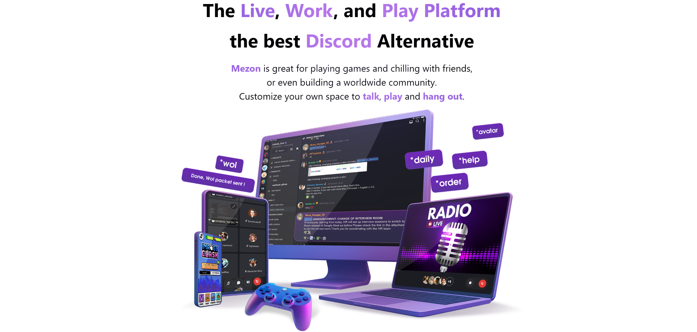

# 

## Key Platform Features

<Columns> 
  <Column className='text--left'>
    ### **⚡ High Performance**
    - Sub-millisecond response times
    - Millions of concurrent connections
    - Enterprise-grade reliability and scalability
  </Column>
  
  <Column className='text--left'>
  ### **🌐 Cross-Platform**
    - Web, Desktop (Windows/macOS/Linux), Mobile (iOS/Android)
    - Universal SDKs with consistent APIs across platforms
    - Progressive Web App support
  </Column>
  
  <Column className='text--left'>
  ### **💰 Built-in Economy**
    - Native token system for rewards and transactions
    - Monetization tools for developers and creators
    - Seamless integration with external payment systems
  </Column>
</Columns>

---

## Build with Mezon

Mezon is great for playing games and chilling with friends, or even building a worldwide community. With powerful SDKs, real-time communication, and a thriving ecosystem, Mezon empowers developers to build the next generation of social interactions.

<Columns> 
  <Column className='text--left'>
    <Card href="./mezon-sdk/integration-bot-sdk" hoverable={true} shadow='tl'>
    <CardHeader>
      <h3>🤖 Bot Applications</h3>
    </CardHeader>
    <CardBody>
      Develop intelligent bots and automated integrations to enhance the Mezon experience with powerful server-side capabilities.
    </CardBody>
  </Card>
  </Column>
  <Column className='text--left'>
    <Card href="./mezon-sdk/channel-app-sdk" hoverable={true} shadow='tl'>
    <CardHeader>
      <h3>🌐 Channel Applications</h3>
    </CardHeader>
    <CardBody>
     Build and integrate your website directly on the Mezon channel to provide a seamless user experience with the available ecosystem.
    </CardBody>
  </Card>
  </Column>
</Columns>

---

## Webhooks

<Columns> 
  <Column className='text--left'>
    <Card href="./webhooks/clan-webhook" hoverable={true} shadow='tl'>
    <CardHeader>
      <h3>Clan webhook</h3>
    </CardHeader>
    <CardBody>
    Send messages to clan members' inboxes.
    </CardBody>
  </Card>
  </Column>
  <Column className='text--left'>
    <Card href="./webhooks/channel-webhook" hoverable={true} shadow='tl'>
    <CardHeader>
      <h3>Channel webhook</h3>
    </CardHeader>
    <CardBody>
    Send a message to a specific channel.
    </CardBody>
  </Card>
  </Column>
</Columns>

---

## Find Support

Connect with the developer community, report issues, and stay updated with platform changes.

### **🤝 Community Support**
Get help from experienced developers and the Mezon team.

- **[Join Mezon Community](https://mezon.ai/invite/1840697268164890624)** - Connect with other developers and get support
- **[Developer Portal](https://mezon.ai/developers)** - Manage your applications and access developer tools
- **[API Documentation](./category/mezon-sdk)** - Complete reference for all available APIs

### **🚀 Get Started Today**
Ready to build your first Mezon application?

- Get Started with creating your **[Bot](./quick-start/creating-mezon-bot)** or **[App](./quick-start/creating-mezon-app)**.
- Follow the **[Guide](./mezon-sdk)** to build your own bot.

---

*Ready to transform how people connect and collaborate? Start building on Mezon today and join millions of users in the next generation of social experiences.*
