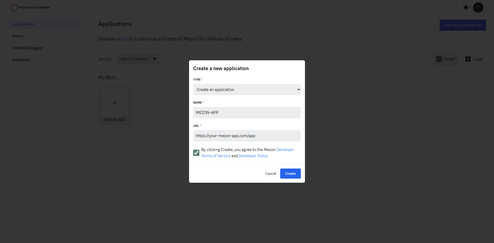
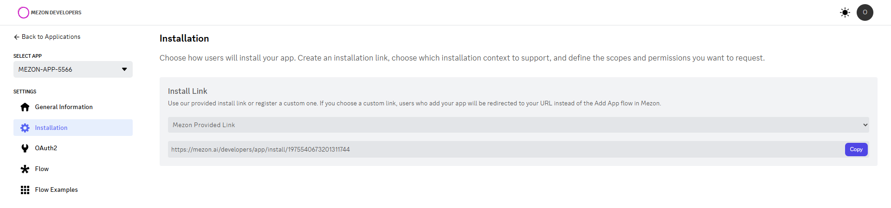
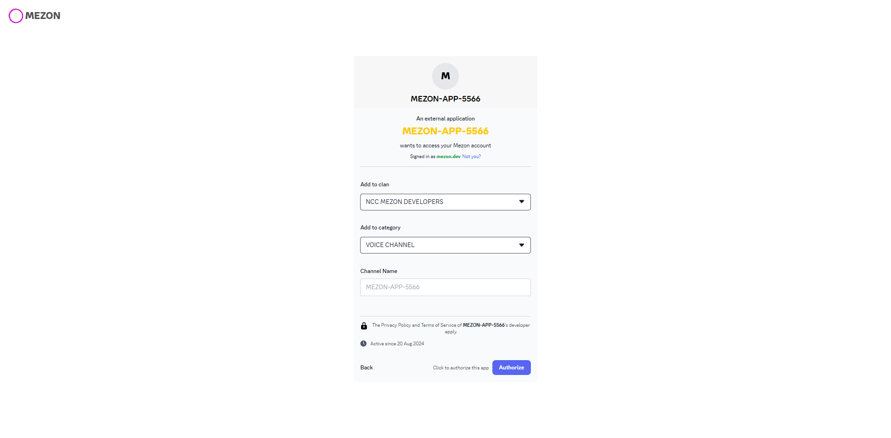
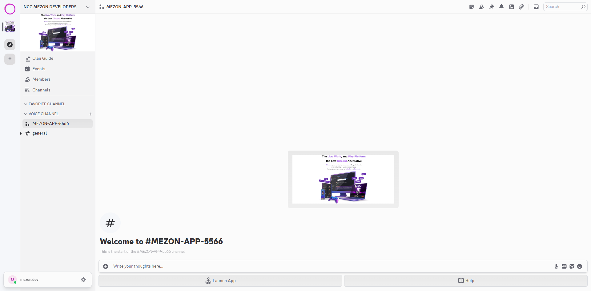

# Creating a Mezon App Account

Similar to bot accounts, creating an app account is also a fairly simple process.

1. Make sure you’re logged on to the [Mezon website](https://mezon.ai/).

2. Access to the [developer portal](https://mezon.ai/developers).

3. Click on the `New Application` button.

4. Choose type is `Create an application` and give the app a name and click `Create`.
5. Configure the URL to your web application.
    

6. The `General Information` provide your app's information.

  - Use `App Id` as token to login when using **[Mezon App SDK](../mezon-sdk/channel-app-sdk/overview.md)**

## Installing Your App

So you have created a `App User` but that user is not actually part of any clan. If you want to use the app, you have to install the app via the installation URL in the `Installation` tab.

1. Make sure you’re logged on to the [Mezon website](https://mezon.ai/).

2. Navigate to the `Installation` in the [developer portal](https://mezon.ai/developers).

Now you can use the install link to add the app to the clan. Copy and paste the URL into the browser, select the clan to install the app and click `Authorize`.

You can customize the name of the channel app or it will be the default name. And your app will appear as a channel in the clan channel list.

:::info NOTE
The person adding the bot needs `Manage Clan` permissions to do so.
:::