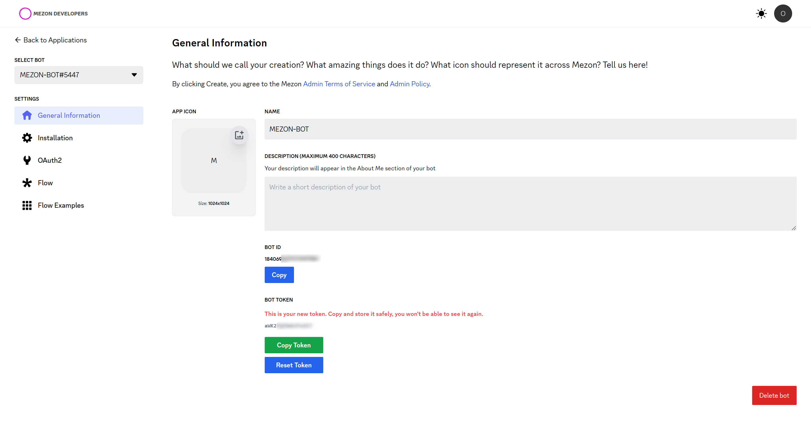

# Creating a Mezon Bot Account

In order to work with the library and the Mezon API in general, we must first create a Mezon Bot account.

Creating a Bot account is a pretty straightforward process.

1. Make sure you’re logged on to the [Mezon website](https://mezon.ai/).

2. Access to the [developer portal](https://mezon.ai/developers).

3. Click on the `New Application` button.

4. Choose type is `Create a bot` and give the bot a name and click `Create`.
    

  - You can make your bot invisible via the `Shadow Bot` option. Your bot's interactions will be displayed under your name in clans.

5. The `General Information` provide your bot's information.

  - Use `Bot Id` as token to login when using **[Mezon Bot SDK](../mezon-sdk/integration-bot-sdk/overview.md)**

## Inviting Your Bot

So you’ve made a Bot User but it’s not actually in any clan.

If you want to invite your bot you must create an invite URL for it.

1. Make sure you’re logged on to the [Mezon website](https://mezon.ai/).

2. Navigate to the `Installation` in the [developer portal](https://mezon.ai/developers).

Now the install link can be used to add your bot to a clan. Copy and paste the URL into your browser, choose a clan to invite the bot to, and click `Authorize`.

:::info NOTE
The person adding the bot needs `Manage Clan` permissions to do so.
:::