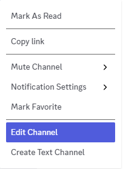
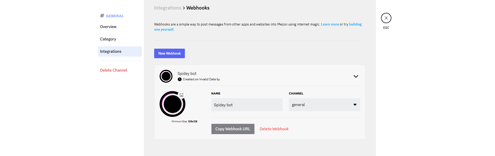

# Channel Webhook

Mezon provides a feature that allows users to send messages to channels through corresponding created webhooks.

## Creating a Channel Webhook

First, to work with channel webhooks, you need to make sure you are a member of a clan and have access to a channel.

Creating a webhook is a pretty straightforward process.

1. Go to the channel you want to create a webhook for, right-click to bring up a popup of actions that can be performed on that channel.

   

2. Click on the **`Edit Channel`** option and then go to the **`Integrations`** tab.

   

3. Click on **`New Webhook`** to proceed with creating a new webhook.

   

- You will have one user (here named Spidey bot) and can customize this bot's name and avatar.

- Click on **`Copy Webhook URL`** to get the webhook's endpoint, use it with the **[webhook payload](#webhook-specification)** to send messages to the channel.

## Webhook Specification

### Endpoint

The webhook is delivered via an HTTP POST request to a unique URL generated for each webhook integration.

**URL Structure:**

```
https://webhook.mezon.ai/webhooks/{channelId}/{token}
```

**URL Parameters:**

| Parameter   | Type   | Description                                                                                                                                                                          |
| :---------- | :----- | :----------------------------------------------------------------------------------------------------------------------------------------------------------------------------------- |
| `channelId` | string | A unique identifier for the channel.                                                                                                                                                 |
| `token`     | string | A security token for authenticating the request. It appears to be a base64 encoded string or a JSON Web Token (JWT) containing information for verifying the request's authenticity. |

### Request Header

| Header         | Value              | Description                                        |
| -------------- | ------------------ | -------------------------------------------------- |
| `Content-Type` | `application/json` | Indicates that the request body is in JSON format. |

### Request Body

The body of the request contains a JSON object with details of the message that triggered the webhook.

#### Root Object

| Field     | Type   | Required | Description                                                      |
| --------- | ------ | -------- | ---------------------------------------------------------------- |
| `type`    | string | Yes      | The type of the webhook event. For this example, it is `"hook"`. |
| `message` | object | Yes      | An object containing the details of the message.                 |

---

### Message Formatting

This object encapsulates the content and metadata of the message.

| Field      | Type             | Required | Description                                                                                                                                                                                                                                                      |
| ---------- | ---------------- | -------- | ---------------------------------------------------------------------------------------------------------------------------------------------------------------------------------------------------------------------------------------------------------------- |
| `t`        | string           | Yes      | The raw text content of the message.                                                                                                                                                                                                                             |
| `mk`       | array of objects | No       | An array of objects describing markdown or special formatting applied to the message text. It's noteworthy that multiple `mk` arrays can be present. The possible values for `type` within this object could include `lk` (link) and `pre` (pre-formatted text). |
| `mentions` | array of objects | No       | An array of objects, each representing a user mentioned in the message.                                                                                                                                                                                          |
| `images`   | array of objects | No       | An array of objects, each representing an image attached to the message.                                                                                                                                                                                         |

#### `mk` Object (markdown)

| Field  | Type    | Required | Description                                                              |
| ------ | ------- | -------- | ------------------------------------------------------------------------ |
| `type` | string  | Yes      | The type of formatting applied (e.g., `"lk"`, `"pre"`).                  |
| `s`    | integer | Yes      | The starting character index of the formatted segment in the `t` string. |
| `e`    | integer | Yes      | The ending character index of the formatted segment in the `t` string.   |

#### `mentions` Object

| Field      | Type    | Required | Description                                                    |
| ---------- | ------- | -------- | -------------------------------------------------------------- |
| `username` | string  | Yes      | The username of the mentioned user.                            |
| `user_id`  | string  | Yes      | The unique identifier of the mentioned user.                   |
| `s`        | integer | Yes      | The starting character index of the mention in the `t` string. |
| `e`        | integer | Yes      | The ending character index of the mention in the `t` string.   |

#### `images` Object

| Field | Type    | Required | Description                                        |
| ----- | ------- | -------- | -------------------------------------------------- |
| `fn`  | string  | Yes      | The filename of the image.                         |
| `sz`  | integer | Yes      | The size of the image in bytes.                    |
| `url` | string  | Yes      | The public URL to access the image.                |
| `ft`  | string  | Yes      | The MIME type of the image (e.g., `"image/jpeg"`). |
| `w`   | integer | Yes      | The width of the image in pixels.                  |
| `h`   | integer | Yes      | The height of the image in pixels.                 |

### Channel Webhook example

import Tabs from "@theme/Tabs";
import TabItem from "@theme/TabItem";

<Tabs>
  <TabItem value="Bash" label="Bash" default>
    ```bash
    curl --location 'https://webhook.mezon.ai/webhooks/1840666462029615104/MTc2MDAzODcxNTU5NDU0OTgzNzoxODQwNjY2NDYyMDEyODM3ODg4OjE4NDA2NjY0NjIwMjk2MTUxMDQ6MTk3NjM3MTczNTI3MTgzNzY5Ng.zLl5tsGaFYnC3sPXgOhVlZoBNrVeoC8hD6oKv0hxavs' \
    --header 'Content-Type: application/json' \
    --data-raw '{
        "type": "hook",
        "message": {
          "t": "[pre] Webhook message example: [lk] https://mezon.ai \n [mention] mezon.webhook@ncc.asia",
          "mk": [
            {
              "type": "pre",
              "s": 0,
              "e": 30
            },
            {
              "type": "lk",
              "s": 36,
              "e": 54
            }
          ],
          "mentions": [
            {
              "user_id": "1783755414765047808",
              "s": 65,
              "e": 88
            }
          ],
          "images": [
            {
              "fn": "thumbnail_dog1.jpg",
              "sz": 5620,
              "url": "https://cdn.mezon.vn/0/1843962578301095936/1829065039080853500/95_0thumbnail_dog1.jpg",
              "ft": "image/jpeg",
              "w": 275,
              "h": 183
            }
          ]
        }
      }
    ```
  </TabItem>
  <TabItem value="Python" label="Python">
    ```python
    import http.client
    import json

    conn = http.client.HTTPSConnection("webhook.mezon.ai")
    payload = json.dumps({
      "type": "hook",
      "message": {
        "t": "[pre] Webhook message example: [lk] https://mezon.ai \n [mention] mezon.webhook@ncc.asia",
        "mk": [
          {
            "type": "pre",
            "s": 0,
            "e": 30
          },
          {
            "type": "lk",
            "s": 36,
            "e": 54
          }
        ],
        "mentions": [
          {
            "user_id": "1783755414765047808",
            "s": 65,
            "e": 88
          }
        ],
        "images": [
          {
            "fn": "thumbnail_dog1.jpg",
            "sz": 5620,
            "url": "https://cdn.mezon.vn/0/1843962578301095936/1829065039080853500/95_0thumbnail_dog1.jpg",
            "ft": "image/jpeg",
            "w": 275,
            "h": 183
          }
        ]
      }
    })
    headers = {
      'Content-Type': 'application/json'
    }
    conn.request("POST", "/webhooks/1840666462029615104/MTc2MDAzODcxNTU5NDU0OTgzNzoxODQwNjY2NDYyMDEyODM3ODg4OjE4NDA2NjY0NjIwMjk2MTUxMDQ6MTk3NjM3MTczNTI3MTgzNzY5Ng.zLl5tsGaFYnC3sPXgOhVlZoBNrVeoC8hD6oKv0hxavs", payload, headers)
    res = conn.getresponse()
    data = res.read()
    print(data.decode("utf-8"))
    ```
  </TabItem>
  <TabItem value="Go" label="Go">
    ```go
    package main

    import (
      "fmt"
      "strings"
      "net/http"
      "io"
    )

    func main() {

      url := "https://webhook.mezon.ai/webhooks/1840666462029615104/MTc2MDAzODcxNTU5NDU0OTgzNzoxODQwNjY2NDYyMDEyODM3ODg4OjE4NDA2NjY0NjIwMjk2MTUxMDQ6MTk3NjM3MTczNTI3MTgzNzY5Ng.zLl5tsGaFYnC3sPXgOhVlZoBNrVeoC8hD6oKv0hxavs"
      method := "POST"

      payload := strings.NewReader(`{`+"
    "+`
      "type": "hook",`+"
    "+`
      "message": {`+"
    "+`
        "t": "[pre] Webhook message example: [lk] https://mezon.ai \n [mention] mezon.webhook@ncc.asia",`+"
    "+`
        "mk": [`+"
    "+`
          {`+"
    "+`
            "type": "pre",`+"
    "+`
            "s": 0,`+"
    "+`
            "e": 30`+"
    "+`
          },`+"
    "+`
          {`+"
    "+`
            "type": "lk",`+"
    "+`
            "s": 36,`+"
    "+`
            "e": 54`+"
    "+`
          }`+"
    "+`
        ],`+"
    "+`
        "mentions": [`+"
    "+`
          {`+"
    "+`
            "user_id": "1783755414765047808",`+"
    "+`
            "s": 65,`+"
    "+`
            "e": 88`+"
    "+`
          }`+"
    "+`
        ],`+"
    "+`
        "images": [`+"
    "+`
          {`+"
    "+`
            "fn": "thumbnail_dog1.jpg",`+"
    "+`
            "sz": 5620,`+"
    "+`
            "url": "https://cdn.mezon.vn/0/1843962578301095936/1829065039080853500/95_0thumbnail_dog1.jpg",`+"
    "+`
            "ft": "image/jpeg",`+"
    "+`
            "w": 275,`+"
    "+`
            "h": 183`+"
    "+`
          }`+"
    "+`
        ]`+"
    "+`
      }`+"
    "+`
    }`)

      client := &http.Client {
      }
      req, err := http.NewRequest(method, url, payload)

      if err != nil {
        fmt.Println(err)
        return
      }
      req.Header.Add("Content-Type", "application/json")

      res, err := client.Do(req)
      if err != nil {
        fmt.Println(err)
        return
      }
      defer res.Body.Close()

      body, err := io.ReadAll(res.Body)
      if err != nil {
        fmt.Println(err)
        return
      }
      fmt.Println(string(body))
    }
    ```
  </TabItem>
  <TabItem value="Java" label="Java">
    ```java
    OkHttpClient client = new OkHttpClient().newBuilder()
      .build();
    MediaType mediaType = MediaType.parse("application/json");
    RequestBody body = RequestBody.create(mediaType, "{\r\n  \"type\": \"hook\",\r\n  \"message\": {\r\n    \"t\": \"[pre] Webhook message example: [lk] https://mezon.ai \\n [mention] mezon.webhook@ncc.asia\",\r\n    \"mk\": [\r\n      {\r\n        \"type\": \"pre\",\r\n        \"s\": 0,\r\n        \"e\": 30\r\n      },\r\n      {\r\n        \"type\": \"lk\",\r\n        \"s\": 36,\r\n        \"e\": 54\r\n      }\r\n    ],\r\n    \"mentions\": [\r\n      {\r\n        \"user_id\": \"1783755414765047808\",\r\n        \"s\": 65,\r\n        \"e\": 88\r\n      }\r\n    ],\r\n    \"images\": [\r\n      {\r\n        \"fn\": \"thumbnail_dog1.jpg\",\r\n        \"sz\": 5620,\r\n        \"url\": \"https://cdn.mezon.vn/0/1843962578301095936/1829065039080853500/95_0thumbnail_dog1.jpg\",\r\n        \"ft\": \"image/jpeg\",\r\n        \"w\": 275,\r\n        \"h\": 183\r\n      }\r\n    ]\r\n  }\r\n}");
    Request request = new Request.Builder()
      .url("https://webhook.mezon.ai/webhooks/1840666462029615104/MTc2MDAzODcxNTU5NDU0OTgzNzoxODQwNjY2NDYyMDEyODM3ODg4OjE4NDA2NjY0NjIwMjk2MTUxMDQ6MTk3NjM3MTczNTI3MTgzNzY5Ng.zLl5tsGaFYnC3sPXgOhVlZoBNrVeoC8hD6oKv0hxavs")
      .method("POST", body)
      .addHeader("Content-Type", "application/json")
      .build();
    Response response = client.newCall(request).execute();
    ```
  </TabItem>
  <TabItem value="CSharp" label="C#">
    ```CSharp
    var client = new HttpClient();
    var request = new HttpRequestMessage(HttpMethod.Post, "https://webhook.mezon.ai/webhooks/1840666462029615104/MTc2MDAzODcxNTU5NDU0OTgzNzoxODQwNjY2NDYyMDEyODM3ODg4OjE4NDA2NjY0NjIwMjk2MTUxMDQ6MTk3NjM3MTczNTI3MTgzNzY5Ng.zLl5tsGaFYnC3sPXgOhVlZoBNrVeoC8hD6oKv0hxavs");
    var content = new StringContent("{\r\n  \"type\": \"hook\",\r\n  \"message\": {\r\n    \"t\": \"[pre] Webhook message example: [lk] https://mezon.ai \\n [mention] mezon.webhook@ncc.asia\",\r\n    \"mk\": [\r\n      {\r\n        \"type\": \"pre\",\r\n        \"s\": 0,\r\n        \"e\": 30\r\n      },\r\n      {\r\n        \"type\": \"lk\",\r\n        \"s\": 36,\r\n        \"e\": 54\r\n      }\r\n    ],\r\n    \"mentions\": [\r\n      {\r\n        \"user_id\": \"1783755414765047808\",\r\n        \"s\": 65,\r\n        \"e\": 88\r\n      }\r\n    ],\r\n    \"images\": [\r\n      {\r\n        \"fn\": \"thumbnail_dog1.jpg\",\r\n        \"sz\": 5620,\r\n        \"url\": \"https://cdn.mezon.vn/0/1843962578301095936/1829065039080853500/95_0thumbnail_dog1.jpg\",\r\n        \"ft\": \"image/jpeg\",\r\n        \"w\": 275,\r\n        \"h\": 183\r\n      }\r\n    ]\r\n  }\r\n}", null, "application/json");
    request.Content = content;
    var response = await client.SendAsync(request);
    response.EnsureSuccessStatusCode();
    Console.WriteLine(await response.Content.ReadAsStringAsync());
    ```
  </TabItem>
  <TabItem value="Javascrip" label="Javascrip">
    ```js
    const myHeaders = new Headers();
    myHeaders.append("Content-Type", "application/json");

    const raw = JSON.stringify({
      "type": "hook",
      "message": {
        "t": "[pre] Webhook message example: [lk] https://mezon.ai \n [mention] mezon.webhook@ncc.asia",
        "mk": [
          {
            "type": "pre",
            "s": 0,
            "e": 30
          },
          {
            "type": "lk",
            "s": 36,
            "e": 54
          }
        ],
        "mentions": [
          {
            "user_id": "1783755414765047808",
            "s": 65,
            "e": 88
          }
        ],
        "images": [
          {
            "fn": "thumbnail_dog1.jpg",
            "sz": 5620,
            "url": "https://cdn.mezon.vn/0/1843962578301095936/1829065039080853500/95_0thumbnail_dog1.jpg",
            "ft": "image/jpeg",
            "w": 275,
            "h": 183
          }
        ]
      }
    });

    const requestOptions = {
      method: "POST",
      headers: myHeaders,
      body: raw,
      redirect: "follow"
    };

    fetch("https://webhook.mezon.ai/webhooks/1840666462029615104/MTc2MDAzODcxNTU5NDU0OTgzNzoxODQwNjY2NDYyMDEyODM3ODg4OjE4NDA2NjY0NjIwMjk2MTUxMDQ6MTk3NjM3MTczNTI3MTgzNzY5Ng.zLl5tsGaFYnC3sPXgOhVlZoBNrVeoC8hD6oKv0hxavs", requestOptions)
      .then((response) => response.text())
      .then((result) => console.log(result))
      .catch((error) => console.error(error));
    ```
  </TabItem>
</Tabs>

**Result**


