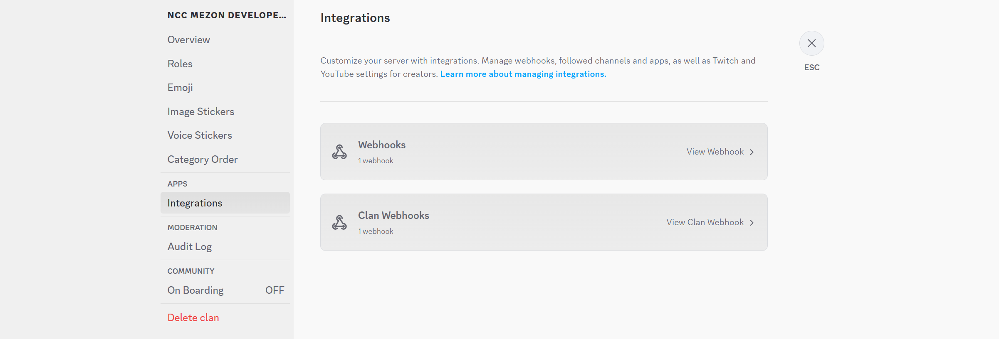
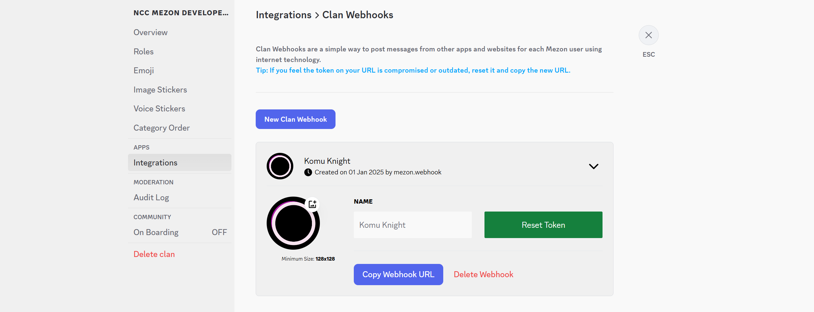
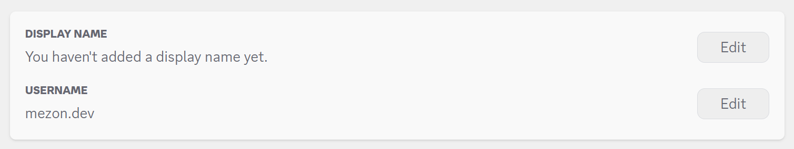
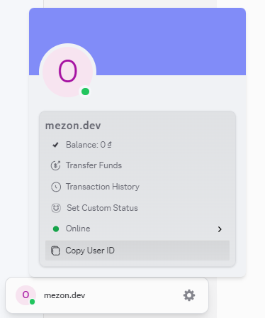
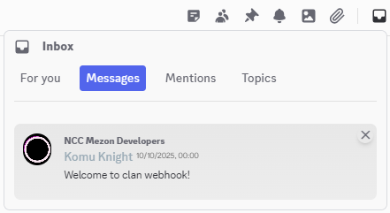

# Clan Webhook

Clan webhook will send DM directly to each person's inbox, who receives the message depends on the `username` or `user ID` provided on the URL.

## Creating a Clan Mezon Webhook

Follow these steps to create a webhook for your clan.

1. Go to the clan you want to create a webhook for, click on clan banner to bring up a popup of actions that can be performed on that clan.

   

2. Click on the **`Clan Settings`** option and then go to the **`Integrations`** tab.

- As a clan manager you can also manage both channel webhooks and clan webhooks here.

  

3. Click on **`Clan Webhooks`** and then **`New Clan Webhook`** to proceed with creating a new webhook.

   

- You will have one user (here named Komu Knight) and can customize this bot's name and avatar.

- Click on **`Copy Webhook URL`** to get the webhook's endpoint, use it with the **[webhook payload](#webhook-specification)** to send messages to the user in your clan.

- There are two ways to construct a complete Webhook URL after copying the base URL using the Copy Webhook URL button

  - **Way 1**: You have to combine the URL you copied with a valid `Mezon Username` to get a complete Webhook URL. The `Mezon Username` can be found in the user's Account Settings.

  

  - **Way 2**: Alternatively, use the copied URL and combine it with a valid `Mezon User ID` to get a complete Webhook URL. The `Mezon User ID` can be found in the user's Account popup.

  

:::tip Note
If you feel the token on your URL is compromised or outdated, reset it and copy the new URL and make sure the user has joined your clan.
:::

## Webhook Specification

### Endpoint

The webhook is delivered via an HTTP POST request to a unique URL generated for each webhook integration combined with a unique user identifier.

**URL Structure:**

```
https://webhook.mezon.ai/clanwebhooks/{token}/{user-identifier}
```

**URL Parameters:**

| Parameter         | Type   | Description                                                                                                                                                                          |
| :---------------- | :----- | :----------------------------------------------------------------------------------------------------------------------------------------------------------------------------------- |
| `token`           | string | A security token for authenticating the request. It appears to be a base64 encoded string or a JSON Web Token (JWT) containing information for verifying the request's authenticity. |
| `user-identifier` | string | A unique identifier for the Mezon user. It can be either a username or a user ID.                                                                                                    |

### Request Header

| Header         | Value              | Description                                        |
| -------------- | ------------------ | -------------------------------------------------- |
| `Content-Type` | `application/json` | Indicates that the request body is in JSON format. |

### Request Body

The body of the request contains a JSON object with the content and attachments of the message to be sent as a direct message to the user.

#### Root Object

| Field         | Type             | Required | Description                                                  |
| ------------- | ---------------- | -------- | ------------------------------------------------------------ |
| `content`     | string           | Yes      | A JSON-encoded string containing the message content details |
| `attachments` | array of objects | No       | An array of attachment objects (images, videos, files, etc.) |

---

### Message Content

The `content` field contains a JSON-encoded string that must be parsed to access the message structure.

**Parsed Content Object:**

| Field | Type             | Required | Description                                                      |
| ----- | ---------------- | -------- | ---------------------------------------------------------------- |
| `t`   | string           | Yes      | The raw text content of the message.                             |
| `mk`  | array of objects | No       | An array of objects describing markdown or special formatting.   |

#### `mk` Object (markdown)

| Field  | Type    | Required | Description                                                              |
| ------ | ------- | -------- | ------------------------------------------------------------------------ |
| `type` | string  | Yes      | The type of formatting applied (e.g., `"lk"` for link, `"pre"` for preformatted text). |
| `s`    | integer | Yes      | The starting character index of the formatted segment in the `t` string. |
| `e`    | integer | Yes      | The ending character index of the formatted segment in the `t` string.   |

### Attachments

The `attachments` array contains objects representing files attached to the message.

#### Attachment Object

| Field      | Type   | Required | Description                                            |
| ---------- | ------ | -------- | ------------------------------------------------------ |
| `url`      | string | Yes      | The public CDN URL to access the attachment.           |
| `filetype` | string | Yes      | The MIME type of the file (e.g., `"image/png"`, `"video/mp4"`). |

### Clan Webhook example

import Tabs from "@theme/Tabs";
import TabItem from "@theme/TabItem";

<Tabs>
  <TabItem value="Bash" label="Bash" default>
    ```bash
    curl --location --globoff 'https://webhook.mezon.ai/clanwebhooks/{YOUR_TOKEN}/{username_or_userid}' \
    --header 'Content-Type: application/json' \
    --data '{
        "content": "{\"t\":\"Welcome to Mezon Clan webhook!!! [pre] This is a block message. [lk] https://mezon.ai\",\"mk\":[{\"type\":\"pre\",\"s\":33,\"e\":64},{\"type\":\"lk\",\"s\":68,\"e\":85}]}",
        "attachments": [
            {
                "url": "https://cdn.mezon.vn/0/1843962578301095936/1829065039080853500/95_0thumbnail_dog1.jpg",
                "filetype": "image/png"
            },
            {
                "url": "https://cdn.mezon.vn/109056000/255856640/4198400/477_0bandicam_2024_11_19_11_10_14_507.mp4",
                "filetype": "video/mp4"
            }
        ]
    }'
    ```
  </TabItem>
  <TabItem value="Python" label="Python">
    ```python
    import http.client
    import json

    conn = http.client.HTTPSConnection("webhook.mezon.ai")
    payload = json.dumps({
      "content": "{\"t\":\"Welcome to Mezon Clan webhook!!! [pre] This is a block message. [lk] https://mezon.ai\",\"mk\":[{\"type\":\"pre\",\"s\":33,\"e\":64},{\"type\":\"lk\",\"s\":68,\"e\":85}]}",
      "attachments": [
        {
          "url": "https://cdn.mezon.vn/0/1843962578301095936/1829065039080853500/95_0thumbnail_dog1.jpg",
          "filetype": "image/png"
        },
        {
          "url": "https://cdn.mezon.vn/109056000/255856640/4198400/477_0bandicam_2024_11_19_11_10_14_507.mp4",
          "filetype": "video/mp4"
        }
      ]
    })
    headers = {
      'Content-Type': 'application/json'
    }
    conn.request("POST", "/clanwebhooks/{YOUR_TOKEN}/{username_or_userid}", payload, headers)
    res = conn.getresponse()
    data = res.read()
    print(data.decode("utf-8"))
    ```
  </TabItem>
  <TabItem value="Go" label="Go">
    ```go
    package main

    import (
      "fmt"
      "strings"
      "net/http"
      "io"
    )

    func main() {

      url := "https://webhook.mezon.ai/clanwebhooks/{YOUR_TOKEN}/{username_or_userid}"
      method := "POST"

      payload := strings.NewReader(`{`+"
    "+`
        "content": "{\"t\":\"Welcome to Mezon Clan webhook!!! [pre] This is a block message. [lk] https://mezon.ai\",\"mk\":[{\"type\":\"pre\",\"s\":33,\"e\":64},{\"type\":\"lk\",\"s\":68,\"e\":85}]}",`+"
    "+`
        "attachments": [`+"
    "+`
            {`+"
    "+`
                "url": "https://cdn.mezon.vn/0/1843962578301095936/1829065039080853500/95_0thumbnail_dog1.jpg",`+"
    "+`
                "filetype": "image/png"`+"
    "+`
            },`+"
    "+`
            {`+"
    "+`
                "url": "https://cdn.mezon.vn/109056000/255856640/4198400/477_0bandicam_2024_11_19_11_10_14_507.mp4",`+"
    "+`
                "filetype": "video/mp4"`+"
    "+`
            }`+"
    "+`
        ]`+"
    "+`
    }`)

      client := &http.Client {
      }
      req, err := http.NewRequest(method, url, payload)

      if err != nil {
        fmt.Println(err)
        return
      }
      req.Header.Add("Content-Type", "application/json")

      res, err := client.Do(req)
      if err != nil {
        fmt.Println(err)
        return
      }
      defer res.Body.Close()

      body, err := io.ReadAll(res.Body)
      if err != nil {
        fmt.Println(err)
        return
      }
      fmt.Println(string(body))
    }
    ```
  </TabItem>
  <TabItem value="Java" label="Java">
    ```java
    OkHttpClient client = new OkHttpClient().newBuilder()
      .build();
    MediaType mediaType = MediaType.parse("application/json");
    RequestBody body = RequestBody.create(mediaType, "{\r\n    \"content\": \"{\\\"t\\\":\\\"Welcome to Mezon Clan webhook!!! [pre] This is a block message. [lk] https://mezon.ai\\\",\\\"mk\\\":[{\\\"type\\\":\\\"pre\\\",\\\"s\\\":33,\\\"e\\\":64},{\\\"type\\\":\\\"lk\\\",\\\"s\\\":68,\\\"e\\\":85}]}\",\r\n    \"attachments\": [\r\n        {\r\n            \"url\": \"https://cdn.mezon.vn/0/1843962578301095936/1829065039080853500/95_0thumbnail_dog1.jpg\",\r\n            \"filetype\": \"image/png\"\r\n        },\r\n        {\r\n            \"url\": \"https://cdn.mezon.vn/109056000/255856640/4198400/477_0bandicam_2024_11_19_11_10_14_507.mp4\",\r\n            \"filetype\": \"video/mp4\"\r\n        }\r\n    ]\r\n}");
    Request request = new Request.Builder()
      .url("https://webhook.mezon.ai/clanwebhooks/{YOUR_TOKEN}/{username_or_userid}")
      .method("POST", body)
      .addHeader("Content-Type", "application/json")
      .build();
    Response response = client.newCall(request).execute();
    ```
  </TabItem>
  <TabItem value="CSharp" label="C#">
    ```CSharp
    var client = new HttpClient();
    var request = new HttpRequestMessage(HttpMethod.Post, "https://webhook.mezon.ai/clanwebhooks/{YOUR_TOKEN}/{username_or_userid}");
    var content = new StringContent("{\r\n    \"content\": \"{\\\"t\\\":\\\"Welcome to Mezon Clan webhook!!! [pre] This is a block message. [lk] https://mezon.ai\\\",\\\"mk\\\":[{\\\"type\\\":\\\"pre\\\",\\\"s\\\":33,\\\"e\\\":64},{\\\"type\\\":\\\"lk\\\",\\\"s\\\":68,\\\"e\\\":85}]}\",\r\n    \"attachments\": [\r\n        {\r\n            \"url\": \"https://cdn.mezon.vn/0/1843962578301095936/1829065039080853500/95_0thumbnail_dog1.jpg\",\r\n            \"filetype\": \"image/png\"\r\n        },\r\n        {\r\n            \"url\": \"https://cdn.mezon.vn/109056000/255856640/4198400/477_0bandicam_2024_11_19_11_10_14_507.mp4\",\r\n            \"filetype\": \"video/mp4\"\r\n        }\r\n    ]\r\n}", null, "application/json");
    request.Content = content;
    var response = await client.SendAsync(request);
    response.EnsureSuccessStatusCode();
    Console.WriteLine(await response.Content.ReadAsStringAsync());
    ```
  </TabItem>
  <TabItem value="Javascript" label="Javascript">
    ```js
    const myHeaders = new Headers();
    myHeaders.append("Content-Type", "application/json");

    const raw = JSON.stringify({
      "content": "{\"t\":\"Welcome to Mezon Clan webhook!!! [pre] This is a block message. [lk] https://mezon.ai\",\"mk\":[{\"type\":\"pre\",\"s\":33,\"e\":64},{\"type\":\"lk\",\"s\":68,\"e\":85}]}",
      "attachments": [
        {
          "url": "https://cdn.mezon.vn/0/1843962578301095936/1829065039080853500/95_0thumbnail_dog1.jpg",
          "filetype": "image/png"
        },
        {
          "url": "https://cdn.mezon.vn/109056000/255856640/4198400/477_0bandicam_2024_11_19_11_10_14_507.mp4",
          "filetype": "video/mp4"
        }
      ]
    });

    const requestOptions = {
      method: "POST",
      headers: myHeaders,
      body: raw,
      redirect: "follow"
    };

    fetch("https://webhook.mezon.ai/clanwebhooks/{YOUR_TOKEN}/{username_or_userid}", requestOptions)
      .then((response) => response.text())
      .then((result) => console.log(result))
      .catch((error) => console.error(error));
    ```
  </TabItem>
</Tabs>

**Result**

You can see the messages sent from clan webhooks in your **`Inbox`**.



:::note
Replace `YOUR_TOKEN` with your actual webhook token and `username_or_userid` with either the recipient's Mezon username or user ID. The user must be a member of your clan to receive the direct message.
:::
