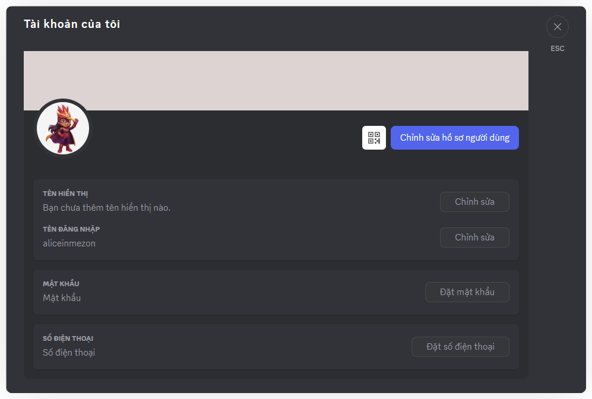
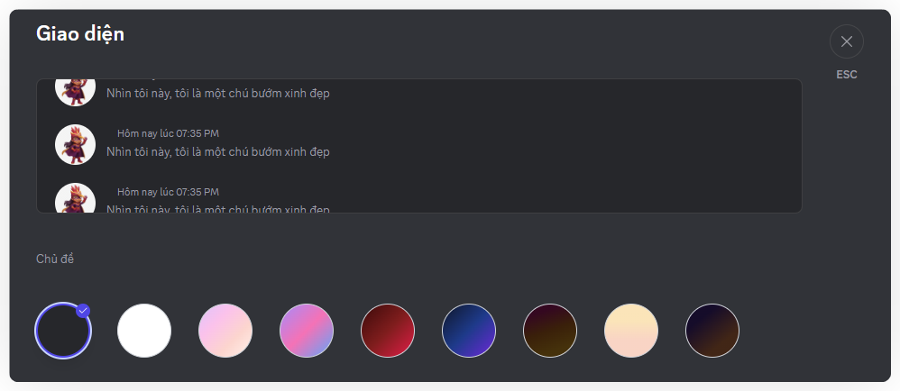
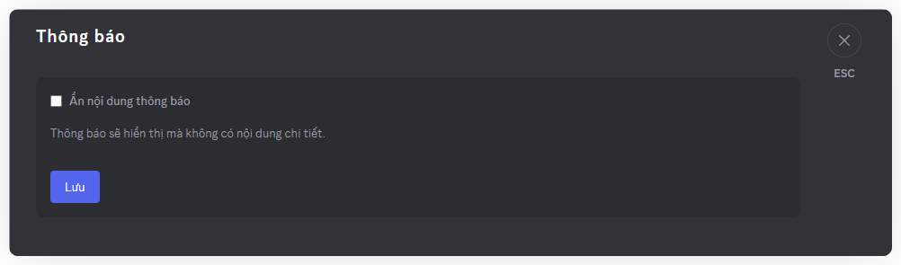
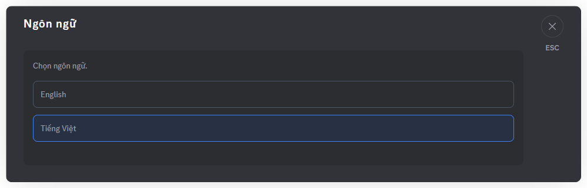

# Tùy chỉnh cá nhân hóa
Ai cũng muốn không gian giao tiếp mang dấu ấn riêng. Với Mezon, bạn có thể tùy chỉnh hồ sơ, giao diện, ngôn ngữ và thông báo — để tạo nên phiên bản Mezon chỉ dành riêng cho bạn

Trong phần **Cài đặt cá nhân**, bạn sẽ thấy các mục sau:

### **1. Tài khoản – Thông tin tài khoản & mật khẩu**

* Quản lý tên người dùng, đặt lại mật khẩu.
* Nếu bạn đăng ký bằng email, đừng quên thêm mật khẩu để đăng nhập nhanh hơn và bảo mật hơn.

### **2. Hồ sơ – Hồ sơ cá nhân**

* Đặt tên hiển thị.
* Thêm ảnh đại diện và tiểu sử ngắn.
* Thay đổi Biểu tượng tin nhắn riêng - thay thế cho Logo Mezon để truy cập vào tin nhắn cá nhân
* Thay đổi Hồ sơ Clan cho từng Clan. Đây là cách để bạn bè hoặc đồng đội trong Clan nhận ra bạn ngay lập tức.
* Mã QR tới tài khoản cá nhân của bạn. Người khác có thể quét mã QR để kết nối/kết bạn/gọi điện cho bạn.

:::tip
Bạn có thể đặt tên hiển thị và ảnh đại diện riêng biệt khác nhau cho từng Clan bạn tham gia!
:::

:::warning
Giới hạn dung lượng của ảnh đại diện là 10Mb. Nếu vượt quá dung lượng, Mezon sẽ tự động crop giúp bạn.

Giới hạn dung lượng của Biểu tượng tin nhắn riêng là 1Mb.&#x20;
:::

### 3. Giao diện

* Tùy chỉnh chủ đề màu hợp với phong cách của bạn

:::tip
Dùng chế độ tối khi chat ban đêm sẽ thoải mái mắt hơn.
:::

### 4. Thông báo – Cài đặt thông báo

* Ẩn nội dung chi tiết khi cần sự riêng tư.

:::tip
Thông báo sẽ hiện tiêu đề mà không kèm nội dung, giúp bạn yên tâm hơn khi làm việc hoặc chia sẻ màn hình.
:::

### 5. Ngôn ngữ – Ngôn ngữ giao diện

* Hiện Mezon hỗ trợ **Tiếng Việt** và **Tiếng Anh**.
* Bạn có thể đổi ngôn ngữ bất kỳ lúc nào trong phần này.

### 6. Đăng xuất

* Nếu bạn dùng máy tính công cộng, hãy nhớ đăng xuất để tránh bị lộ thông tin