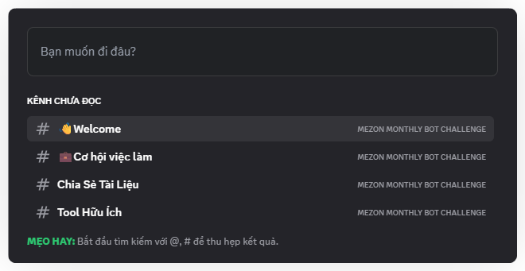
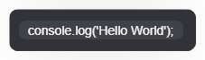

# Phím tắt
Mezon được xây dựng để bạn có thể thao tác nhanh chóng và hiệu quả. Việc làm chủ các phím tắt sẽ giúp bạn tiết kiệm thời gian, tăng cường năng suất và kiểm soát cuộc trò chuyện một cách mượt mà.

## Phím tắt Điều hướng & Tìm kiếm:

* **Ctrl + K:** Bộ Chuyển Đổi Nhanh – Dễ dàng tìm kiếm và chuyển đổi tức thì giữa các kênh, chủ đề hoặc tin nhắn trực tiếp. Đây là phím tắt bạn sẽ sử dụng thường xuyên nhất!

:::tip
* Bắt đầu tìm kiếm với @ để tìm tên người dùng.
* Bắt đầu tìm kiếm với # để tìm Kênh hoặc chủ đề.
:::

## Phím tắt Giao tiếp & Định dạng:

* **Ctrl + G**: Gửi Tin Nhắn Buzz – Gửi âm thanh Buzz đến tất cả người dùng trong kênh hoặc tin nhắn trực tiếp kể cả đã tắt thông báo, thu hút sự chú ý ngay tức khắc.

* **Shift + Enter**: Tạo dòng mới trong tin nhắn mà không gửi đi.

* **Ctrl + Shift + Enter**: Tin Nhắn Ẩn Danh: Nhấn tổ hợp phím này để bật/tắt chế độ gửi tin nhắn ẩn danh trong kênh.

* **Ctrl + B**: In Đậm – Định dạng văn bản nhanh chóng khi trò chuyện.

* **Chữ lớn:** Làm nổi bật các tin nhắn quan trọng – Gõ **#** rồi thêm một khoảng trắng để tạo chữ lớn trong khung chat.

:::info
Dùng **#** đến **#####** để tạo các cấp độ tiêu đề từ 1 đến 6.
:::

**Khối mã (Code Blocks):  \`văn bản của bạn\`** – Dùng **một dấu huyền ngược** (\`) để làm nổi bật đoạn văn bản ngắn trong dòng.

:::tip
Dùng **ba dấu huyền ngược** (\`\`\`) để tạo **khối mã nhiều dòng**, thích hợp cho các đoạn mã dài hơn.

:::

## Phím tắt Quản lý giao diện:

* **Ctrl** + **Shift** + **+**: Zoom In – Phóng to giao diện ứng dụng để dễ nhìn hơn.
* **Ctrl** + **-**: Zoom Out – Thu nhỏ giao diện ứng dụng.
* **Ctrl** + **0**: Reset Zoom – Khôi phục kích thước hiển thị về mức ban đầu.
* **Ctrl** + **W**: Ẩn/Đóng Cửa Sổ (trên Windows/Linux: đóng tab; trên macOS: ẩn app)
* **Ctrl** + **R**: Reload App – Khởi động lại ứng dụng Mezon để khắc phục các sự cố nhỏ hoặc tải cập nhật.
* **Ctrl** + **Shift** + **I**: Mở Công Cụ Phát Triển (DevTools) – Dành cho người dùng nâng cao hoặc những ai muốn kiểm tra các yếu tố kỹ thuật của ứng dụng.