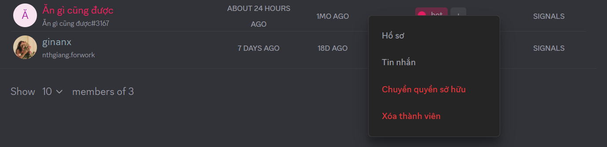

import Tabs from "@theme/Tabs";
import TabItem from "@theme/TabItem";
import manageBotsAndAppsMobile001 from "./images/manage-bots-and-apps-mobile-001.png";
import manageBotsAndAppsMobile002 from "./images/manage-bots-and-apps-mobile-002.png";

# Quản lý Bots
Việc quản lý Bot và App cũng dễ dàng như cách bạn thêm chúng

<Tabs>
<TabItem value="PC" label="PC">
* **Xem & Điều chỉnh**: Truy cập phần Thành viên trong Clan của bạn. Tại đây, bạn sẽ thấy danh sách tất cả các Bot và App đang hoạt động.

* **Tùy chỉnh vai trò và quyền hạn**: Tương tự như thành viên thông thường, bạn có thể thiết lập vai trò cụ thể cho Bot/App. Điều này giúp bạn kiểm soát chặt chẽ các hành động mà chúng có thể thực hiện trong Clan. Điều chỉnh quyền hạn trong **Cài đặt Clan > Vai trò**.

* **Quản lý nâng cao**: Nhấp vào Bot/App để xem Profile của chúng. Từ đây, bạn có thể gửi tin nhắn trực tiếp, chuyển quyền sở hữu (đối với Bot/App do bạn phát triển), hoặc gỡ Bot/App ra khỏi Clan nếu không còn nhu cầu sử dụng.

:::tip
Bot cũng được quản lý như một thành viên Clan bình thường. Nên bạn có thể tham khảo cách quản lý Bot thông qua [**Quản lý quyền hạn và vai trò**](../clan/create-your-own-clan/manage-clan/overview-settings/roles-and-permissions-management).
:::
</TabItem>
<TabItem value="mobile" label="Mobile">
* **Xem & Điều chỉnh**: Truy cập phần Thành viên trong Clan của bạn. Tại đây, bạn sẽ thấy danh sách tất cả các Bot và App đang hoạt động.

* **Tùy chỉnh quyền hạn và vai trò**: Tương tự như thànvin thông thường, bạn có thể thiết lập vai trò cụ thể cho Bot/App. Điều này giúp bạn kiểm soát chặt chẽ các hành động mà chúng có thể thực hiện trong Clan. [[Xem hướng dẫn Quản lý quyền hạn và vai trò](../clan/create-your-own-clan/manage-clan/overview-settings/roles-and-permissions-management)]

* Tại đây, bạn có thể chuyển quyền sở hữu hay khai trừ bot/app nếu có nhu cầu
</TabItem>
</Tabs>
