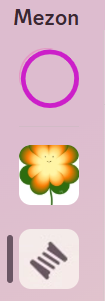
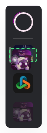
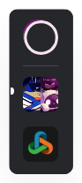
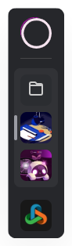
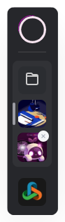
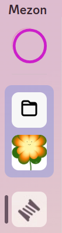

import { Steps, Step } from "@site/src/components/Steps";
import Tabs from "@theme/Tabs";
import TabItem from "@theme/TabItem";
import clanFolderMobile001 from "./images/clan-folder-mobile-001.png";
import clanFolderMobile002 from "./images/clan-folder-mobile-002.png";
import clanFolderMobile003 from "./images/clan-folder-mobile-003.png";
import clanFolderMobile004 from "./images/clan-folder-mobile-004.png";

# Thư mục Clan

Khi tham gia nhiều Clan, danh sách bên trái có thể trở nên dài và khó quản lý. Thư mục Clan giúp bạn nhóm các Clan liên quan lại với nhau, giữ cho giao diện gọn gàng và dễ tìm hơn.

<Tabs>
<TabItem value="PC" label="PC">
### **Tạo Thư mục**

<Steps>
<Step title="Ở giao diện chính của Mezon, chọn Clan bạn muốn đưa vào Thư mục.">

</Step>

<Step title="Kéo Clan đó vào một Clan khác. Khi thấy ô chữ nhật nét đứt màu xanh lá, thả chuột.">

</Step>

<Step title="Thả chuột và thư mục các Clan của bạn sẽ xuất hiện">

</Step>
</Steps>

### Xóa Clan khỏi Thư mục

<Steps>
<Step title="Chọn vào Thư mục chứa các Clan của bạn">

</Step>

<Step title="Di chuyển chuột đến Clan bạn muốn xóa khỏi Thư mục và ấn dấu X">

</Step>

<Step title="Sau khi xóa, Clan sẽ hiển thị bên ngoài Thư mục">

</Step>
</Steps>

</TabItem>
<TabItem value="mobile" label="Mobile">
### Cách tạo thư mục Clan

<Steps>
<Step title="Ở giao diện chính của Mezon, nhấn và giữ Clan bạn muốn đưa vào thư mục.">
</Step>

<Step title="Kéo Clan đó vào một Clan khác. Khi thấy khung vuông hiển thị hai Clan được chọn, thả tay để nhóm chúng lại.">

</Step>

<Step title="Thư mục Clan mới sẽ xuất hiện trong thanh menu bên trái, cùng với các Clan khác.">

</Step>
</Steps>

### Cách xóa Clan khỏi Thư mục

<Steps>
<Step title="Mở Thư mục chứa các Clan của bạn.">
</Step>

<Step title="Nhấn vào biểu tượng X trên Clan bạn muốn xóa khỏi thư mục.">

</Step>

<Step title="Sau khi xóa, Clan sẽ hiển thị trở lại bên ngoài thư mục trong danh sách Clan của bạn.">

</Step>
</Steps>
</TabItem>
</Tabs>
