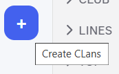

import { Steps, Step } from '@site/src/components/Steps';
import Tabs from "@theme/Tabs";
import TabItem from "@theme/TabItem";
import createAClan002 from "./images/create-a-clan-002.png";
import createAClanMobile001 from "./images/create-a-clan-mobile-001.png";
import createAClanMobile002 from "./images/create-a-clan-mobile-002.png";

# Tạo Clan

<Tabs>
<TabItem value="PC" label="PC">
1. Nhấn vào biểu tượng **+** trên thanh bên → chọn **Tạo Clan**.

2. **Đặt tên Clan** (tối đa 64 ký tự, chỉ dùng chữ cái, số, \_ hoặc -).
3. **Tải lên ảnh đại diện** cho Clan.

:::tip
Đừng lo nếu tên chưa kêu, ảnh chưa đẹp, bạn có thể thay đổi ảnh đại diện sau.
:::

4. Nhấn vào "**Tạo**" để tạo Clan.
</TabItem>
<TabItem value="mobile" label="Mobile">

### Các bước tạo Clan

<Steps>
<Step title="Nhấn vào biểu tượng **+** trên thanh dọc bên trái màn hình.">
    
</Step>

<Step title="**Đặt tên Clan** (tối đa 64 ký tự, chỉ dùng chữ cái, số, \_ hoặc -)">

</Step>

<Step title="**Tải lên ảnh đại diện** cho Clan.">

:::tip
Đừng lo nếu tên chưa kêu, ảnh chưa đẹp, bạn có thể thay đổi ảnh đại diện sau.
:::

</Step>
<Step title="Nhấn vào '**Tạo Clan**'' để tạo Clan.">
</Step>

</Steps>
</TabItem>
</Tabs>
