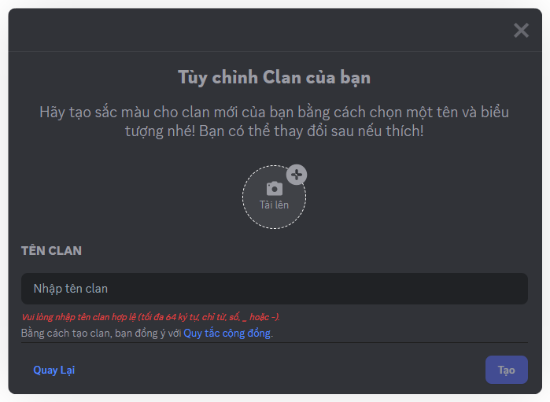

# Tạo Clan

1. Nhấn vào biểu tượng **+** trên thanh bên → chọn **Tạo Clan**.

2. **Đặt tên Clan** (tối đa 64 ký tự, chỉ dùng chữ cái, số, \_ hoặc -).
3. **Tải lên ảnh đại diện** cho Clan.

:::tip
Đừng lo nếu tên chưa kêu, ảnh chưa đẹp, bạn có thể thay đổi ảnh đại diện sau.
:::

4. Nhấn vào "**Tạo**" để tạo Clan.