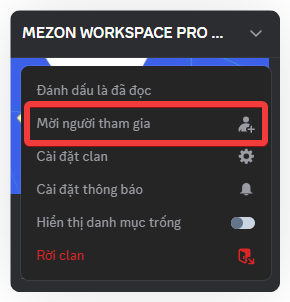
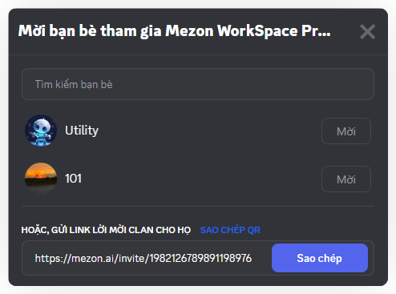

# Mời bạn bè vào Clan
Một Clan chỉ thật sự “sống” khi có bạn bè và đồng đội cùng tham gia. Hãy mời bạn bè vào để bắt đầu những cuộc trò chuyện vui vẻ, chia sẻ hay hợp tác cùng nhau.

1. Nhấn vào **tên Clan** của bạn.
2. Chọn **Mời người tham gia** trong menu.\
   
3. Có 2 cách để mời bạn bè:\
   

* **Mời trực tiếp**: chọn tên bạn bè trong danh sách và nhấn Invite.
* **Gửi link lời mời Clan**: gửi link mời đến bạn bè qua tin nhắn, email hoặc bất kỳ nền tảng nào khác.

:::tip
Bạn có thể copy link mời kèm QR code, rất tiện nếu muốn chia sẻ cho nhiều người cùng tham gia nhanh chóng.
:::