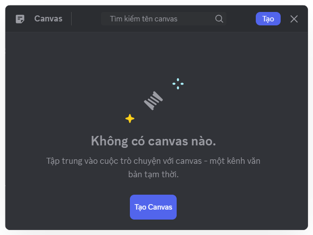

# Bảng ghi chú
Thay vì để tài liệu quan trọng lẫn trong dòng chat, Mezon mang đến Bảng ghi chú – bảng ghi chú và chia sẻ trực quan ngay trong kênh.

### Cách dùng

<Steps>
<Step title="Mở Mezon, chọn **Kênh văn bản** hoặc **Chuỗi thảo luận** bạn cần trao đổi.">
Mở Mezon, chọn **Kênh văn bản** hoặc **Chuỗi thảo luận** bạn cần trao đổi.
</Step>

<Step title="Nhấp vào **biểu tượng trang giấy** trong thanh công cụ của đoạn chat.">

</Step>

<Step title="Chọn **Tạo** để bắt đầu một ghi chú mới">

</Step>

<Step title="Nhập **tiêu đề và nội dung** mà bạn muốn chia sẻ với nhóm.">
</Step>
</Steps>

:::warning
Giới hạn dung lượng file ảnh trong Bảng ghi chú là 50Mb
:::

Với Bảng ghi chú, tất cả thành viên có thể cập nhật theo thời gian thực. Mọi dữ liệu được lưu giữ tập trung, không bị “chìm” trong cuộc trò chuyện, giúp nhóm tiết kiệm thời gian tìm kiếm và nhanh chóng truy xuất được thông tin quan trọng&#x20;