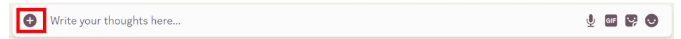
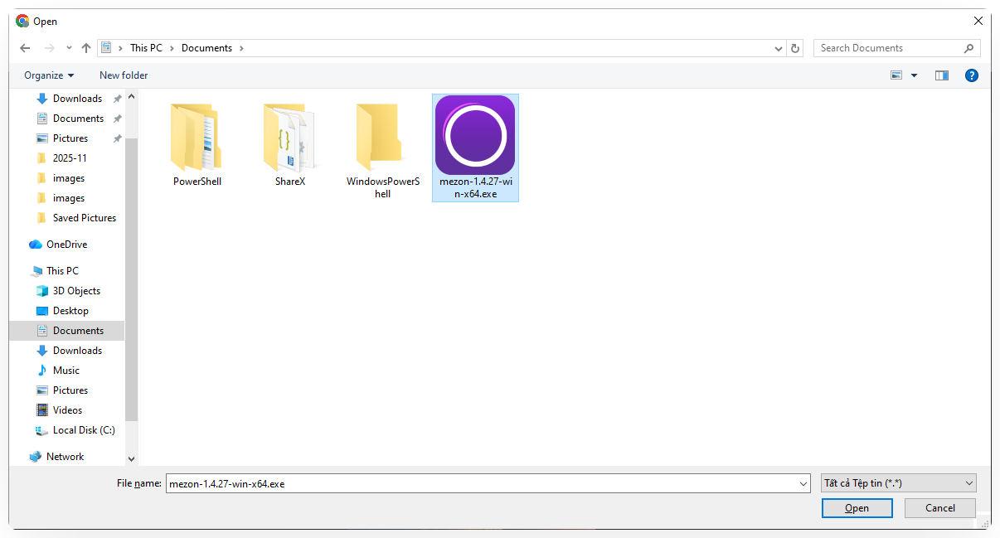
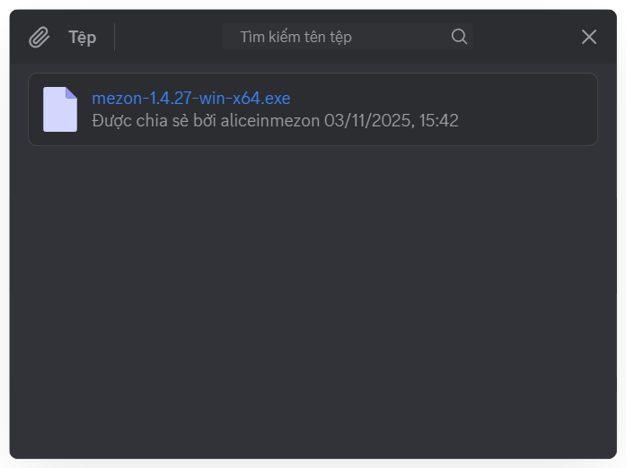
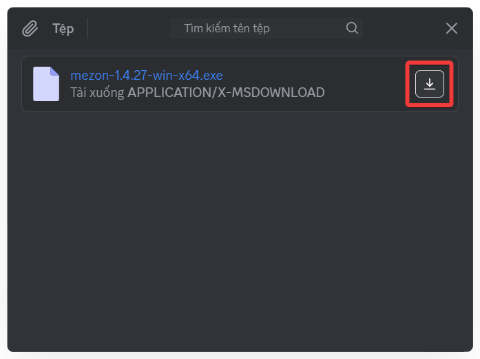

import { Steps, Step } from '@site/src/components/Steps';
import Tabs from "@theme/Tabs";
import TabItem from "@theme/TabItem";
import filesMobile001 from './images/files-mobile-001.png';
import filesMobile003 from './images/files-mobile-003.png';
import filesMobile004 from './images/files-mobile-004.png';
import filesMobile005 from './images/files-mobile-005.png';
import filesMobile006 from './images/files-mobile-006.png';

# Tệp tin

Không chỉ hình ảnh, việc chia sẻ tài liệu cũng quan trọng. Tệp tin giúp bạn
gửi và xem lại toàn bộ tệp đã được chia sẻ trong kênh một cách nhanh chóng.

### Cách gửi Tệp
<Tabs>
<TabItem value="PC" label="PC">
<Steps>
<Step title="Mở **Kênh văn bản** hoặc **Chủ đề** bạn cần trao đổi">
</Step>

<Step title="Nhấn vào **dấu cộng (+)** bên trái ô nhập tin nhắn.">

</Step>

<Step title="Chọn tệp và nhấn **Open**.">

</Step>

<Step title="Thêm mô tả nếu cần, hoặc nhấn **Enter** để gửi ngay.">

</Step>
</Steps>

### Cách xem Tệp đã gửi

<Steps>
<Step title="Trong **Kênh văn bản** hoặc **Chủ đề**, nhấn vào **biểu tượng ghim băng** ở đầu kênh.">

</Step>

<Step title="**Danh sách tệp** sẽ hiển thị kèm theo tên người gửi và thời gian gửi.">

</Step>

<Step title="Nhấn **Tải xuống** để lưu file vào thư mục trên máy tính.">

</Step>
</Steps>

</TabItem>
<TabItem value="mobile" label="Mobile">
<Steps>
<Step title="Mở **Kênh Văn bản** hoặc **Chủ đề** bạn cần trao đổi.">
</Step>

<Step title="Nhấn vào **dấu cộng (+)** bên trái ô nhập tin nhắn.">

</Step>

<Step title="Chọn **Tệp** trong menu">

</Step>

<Step title="Chọn tệp tin mà bạn muốn gửi. Nhập mô tả (nếu cần) và ấn gửi ngay.">

</Step>
</Steps>

### Cách xem tệp tin
<Steps>
<Step title="Trong **Kênh Văn bản** hoặc **Chủ đề**, nhấn vào chọn **Đa phương tiện** ở menu.">

</Step>

<Step title="**Danh sách tệp** sẽ hiển thị kèm theo tên người gửi và thời gian gửi.">

</Step>

<Step title="Nhấn vào tệp để **Tải xuống và xem** trên điện thoại.">
</Step>
</Steps>
</TabItem>
</Tabs>

