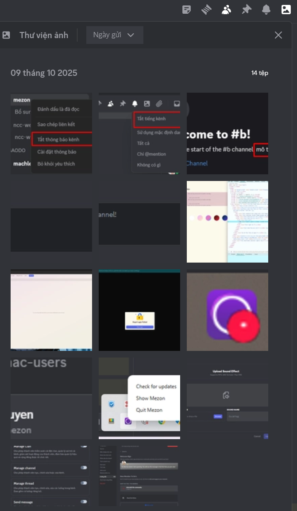
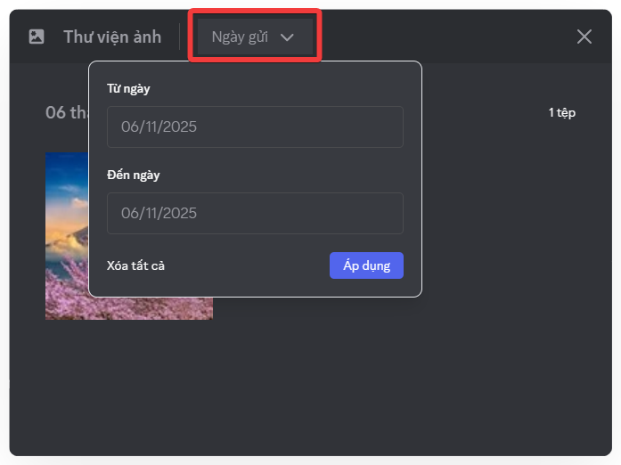
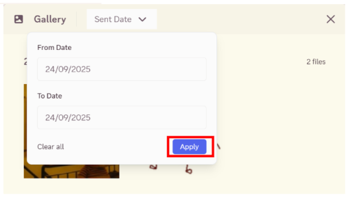

# Thư viện ảnh

Thư viện ảnh giúp bạn xem lại toàn bộ hình ảnh trong Kênh hoặc Chủ đề và dễ
dàng lọc theo thời gian để tìm nội dung cần thiết.

### Cách gửi ảnh

<Steps>
<Step title="Mở **Kênh văn bản** hoặc **Chủ đề** bạn cần trao đổi.">
</Step>

<Step title="Nhấn vào **dấu cộng (+)** bên trái ô nhập tin nhắn.">

</Step>

<Step title="Chọn file ảnh và nhấn **Open**.">

</Step>

<Step title="Thêm **mô tả** nếu cần, hoặc nhấn **Enter** để gửi ngay">

</Step>
</Steps>

### Cách xem ảnh

<Steps>
<Step title="Trong **Kênh văn bản** hoặc **Chủ đề**, nhấn vào **biểu tượng bức ảnh** ở đầu kênh. Nhấn vào bức ảnh mà bạn muốn xem.">

</Step>

<Step title="Bạn có thể tải ảnh, xoay trái/phải, và phóng to/thu nhỏ khi xem chi tiết 1 ảnh">

</Step>
</Steps>

<Steps>
<Step title="Chọn **Ngày gửi** để lọc theo ngày gửi ảnh.">

</Step>

<Step title="Nhấn Áp dụng, ảnh trong khoảng thời gian đã chọn sẽ hiển thị.">

</Step>
</Steps>
