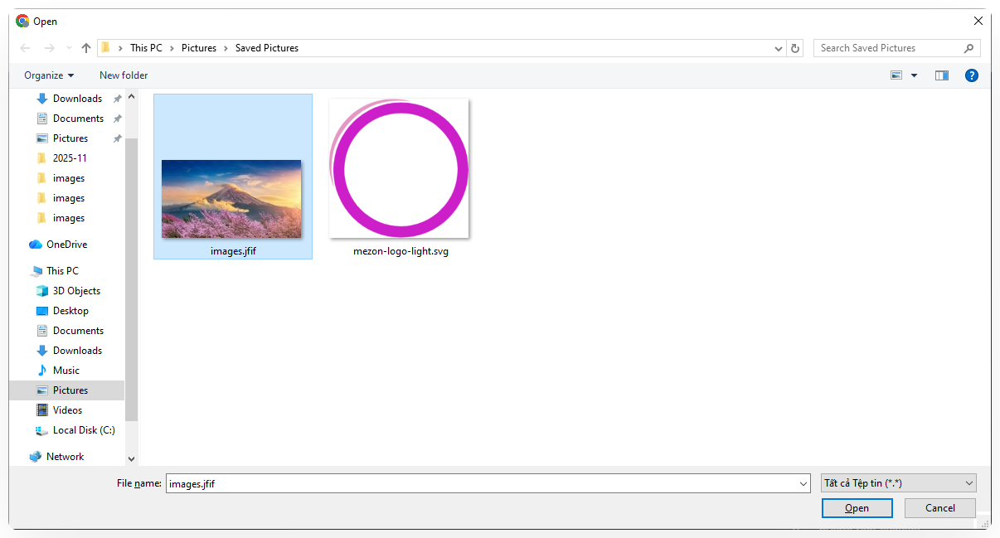
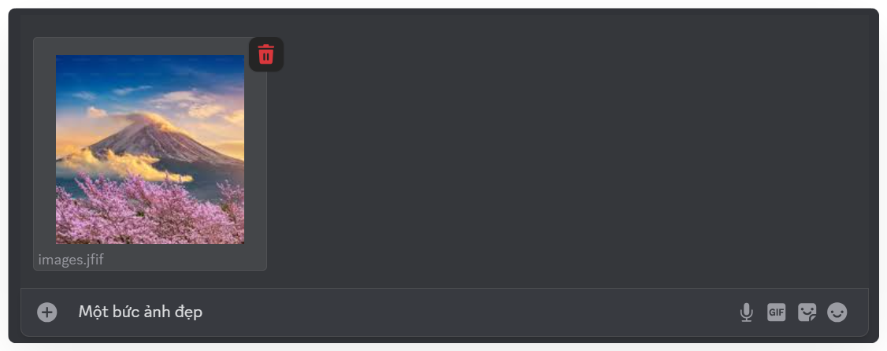
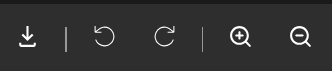

import { Steps, Step } from "@site/src/components/Steps";
import Tabs from "@theme/Tabs";
import TabItem from "@theme/TabItem";
import gallery005 from "./images/gallery-005.png";
import gallery007 from "./images/gallery-007.png";
import gallery008 from "./images/gallery-008.png";
import galleryMobile001 from "./images/gallery-mobile-001.png";
import galleryMobile002 from "./images/gallery-mobile-002.png";
import galleryMobile003 from "./images/gallery-mobile-003.png";
import galleryMobile004 from "./images/gallery-mobile-004.png";
import galleryMobile005 from "./images/gallery-mobile-005.png";

# Thư viện ảnh

Thư viện ảnh giúp bạn xem lại toàn bộ hình ảnh trong Kênh hoặc Chủ đề và dễ
dàng lọc theo thời gian để tìm nội dung cần thiết.

### Cách gửi ảnh

<Tabs>
<TabItem value="PC" label="PC">
<Steps>
<Step title="Mở **Kênh văn bản** hoặc **Chủ đề** bạn cần trao đổi.">
</Step>

<Step title="Nhấn vào **dấu cộng (+)** bên trái ô nhập tin nhắn.">
  
</Step>

<Step title="Chọn file ảnh và nhấn **Open**.">
  
</Step>

<Step title="Thêm **mô tả** nếu cần, hoặc nhấn **Enter** để gửi ngay">

</Step>
</Steps>
</TabItem>
<TabItem value="mobile" label="Mobile">
<Steps>
<Step title="Mở **Kênh Văn bản** hoặc **Chủ đề** bạn cần trao đổi&#x20;">
</Step>

<Step title="Nhấn vào **dấu cộng (+)** bên trái ô nhập tin nhắn.">

</Step>

<Step title="Chọn ảnh cần gửi">

</Step>

<Step title="Thêm **mô tả** nếu cần, hoặc nhấn **mũi tên** để gửi ngay">

</Step>
</Steps>
</TabItem>
</Tabs>

### Cách xem ảnh

<Tabs>
<TabItem value="PC" label="PC">
<Steps>
<Step title="Trong **Kênh văn bản** hoặc **Chủ đề**, nhấn vào **biểu tượng bức ảnh** ở đầu kênh. Nhấn vào bức ảnh mà bạn muốn xem.">

</Step>

<Step title="Bạn có thể tải ảnh, xoay trái/phải, và phóng to/thu nhỏ khi xem chi tiết 1 ảnh">

</Step>
</Steps>

<Steps>
<Step title="Chọn **Ngày gửi** để lọc theo ngày gửi ảnh.">

</Step>

<Step title="Nhấn Áp dụng, ảnh trong khoảng thời gian đã chọn sẽ hiển thị.">

</Step>
</Steps>
</TabItem>
<TabItem value="mobile" label="Mobile">
<Steps>
<Step title="Trong **Kênh Văn bản** hoặc **Chủ đề**, nhấn vào chọn **Đa phương tiện** ở menu.">

</Step>

<Step title="Trong phần **Đa phương tiện**, tất cả hình ảnh từ Kênh Văn bản hoặc Chủ đề được sắp xếp theo từng ngày, giúp bạn dễ dàng xem lại và tìm kiếm nội dung mong muốn.">

  

</Step>
</Steps>
</TabItem>
</Tabs>
