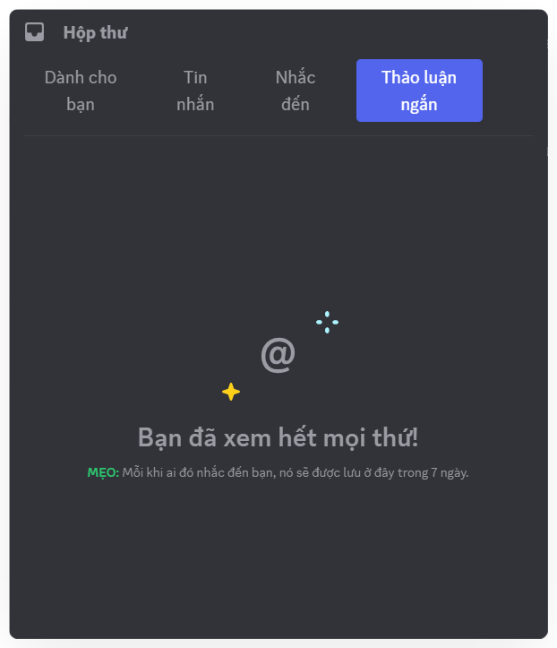

# Hộp thư

Hộp thư giúp bạn không bỏ lỡ tin nhắn cần theo dõi và tập hợp mọi thông báo
quan trọng tại một nơi duy nhất.

### Cách xem Inbox

<Steps>
<Step title="Trên thanh công cụ đầu kênh, chọn **biểu tượng hộp thư**.">

</Step>

<Step title="Vào mục **Tin nhắn** để xem tin nhắn bạn đã thêm, hoặc các tin nhắn quan trọng từ Clan">

</Step>

<Step title="Vào mục **Dành cho bạn** để xem thông báo khi có người kết bạn hoặc gửi Mezon Đồng cho bạn.">

</Step>

<Step title="Vào mục **Nhắc đến** để xem nhanh những tin nhắn bạn được tag.">

</Step>

<Step title="Vào mục **Chủ để truy cập các **Thảo luận ngắn** trong Clan">

</Step>
</Steps>

### Cách thêm tin nhắn vào Hộp thư

<Steps>
<Step title="Nhấn chuột phải vào tin nhắn ở bất kì đâu">
</Step>

<Step title="Chọn **Thêm vào hộp thư**">

</Step>

<Step title="Tin nhắn đó sẽ xuất hiện trong mục **Tin nhắn** của **Hộp thư**, giúp bạn dễ dàng xem lại.">
</Step>
</Steps>
