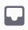

import { Steps, Step } from '@site/src/components/Steps';
import Tabs from "@theme/Tabs";
import TabItem from "@theme/TabItem";
import inbox002 from './images/inbox-002.png';
import inbox003 from './images/inbox-003.png';
import inbox004 from './images/inbox-004.png';
import inbox005 from './images/inbox-005.png';
import inboxMobile002 from './images/inbox-mobile-002.png';
import inboxMobile003 from './images/inbox-mobile-003.png';
import inboxMobile004 from './images/inbox-mobile-004.png';
import inboxMobile005 from './images/inbox-mobile-005.png';
import inboxMobile006 from './images/inbox-mobile-006.png';
import inboxMobile007 from './images/inbox-mobile-007.png';

# Hộp thư

Hộp thư giúp bạn không bỏ lỡ tin nhắn cần theo dõi và tập hợp mọi thông báo
quan trọng tại một nơi duy nhất.

### Cách xem Inbox

<Tabs>
<TabItem value="PC" label="PC">
<Steps>
<Step title="Trên thanh công cụ đầu kênh, chọn **biểu tượng hộp thư**.">

</Step>

<Step title="Vào mục **Tin nhắn** để xem tin nhắn bạn đã thêm, hoặc các tin nhắn quan trọng từ Clan">

</Step>

<Step title="Vào mục **Dành cho bạn** để xem thông báo khi có người kết bạn hoặc gửi Mezon Đồng cho bạn.">

</Step>

<Step title="Vào mục **Nhắc đến** để xem nhanh những tin nhắn bạn được tag.">

</Step>

<Step title="Vào mục **Chủ để truy cập các **Thảo luận ngắn** trong Clan">

</Step>
</Steps>

### Cách thêm tin nhắn vào Hộp thư

<Steps>
<Step title="Nhấn chuột phải vào tin nhắn ở bất kì đâu">
</Step>

<Step title="Chọn **Thêm vào hộp thư**">

</Step>

<Step title="Tin nhắn đó sẽ xuất hiện trong mục **Tin nhắn** của **Hộp thư**, giúp bạn dễ dàng xem lại.">
</Step>
</Steps>
</TabItem>
<TabItem value="mobile" label="Mobile">
<Steps>
<Step title="Truy cập **thanh điều hướng dưới cùng**, chọn biểu tượng **🔔 Hộp thư**.">

</Step>

<Step title="Tại đây, bạn có thể xem toàn bộ hoạt động liên quan đến mình trong Clan.">

*   **@ Nhắc đến:** Hiển thị các tin nhắn mà bạn được tag trực tiếp.

    

* Vào mục **Tin nhắn** để xem tin nhắn bạn đã thêm, hoặc các tin nhắn quan trọng từ Clan 

*   Vào mục **Chủ đề** để truy cập các **Thảo luận ngắn** trong từng Clan khác nhau

    

*   **Dành cho bạn:** Bao gồm thông báo khi có **lời mời kết bạn** và **Mezon Đồng** được gửi đến

    

</Step>
</Steps>

### Cách thêm tin nhắn vào Hộp thư

<Steps>
<Step title="Nhấn và giữ vào **tin nhắn** mà bạn muốn lưu.">
</Step>

<Step title="Chọn **Đánh dấu tin nhắn**">

</Step>

<Step title="Tin nhắn đó sẽ được thêm vào mục **Tin nhắn** trong **Hộp thư**, giúp bạn dễ dàng xem lại bất cứ lúc nào.">
Tin nhắn đó sẽ được thêm vào mục **Tin nhắn** trong **Hộp thư**, giúp bạn dễ dàng xem lại bất cứ lúc nào.

</Step>
</Steps>
</TabItem>
</Tabs>
