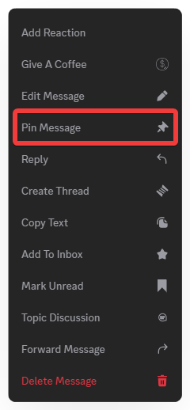
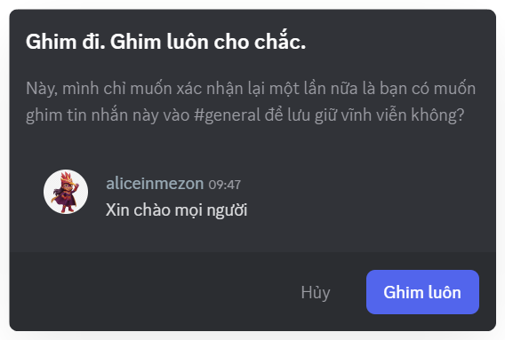
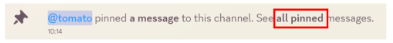
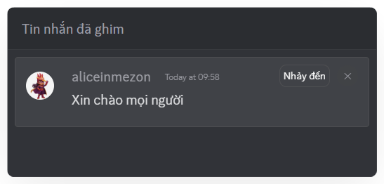

import { Steps, Step } from "@site/src/components/Steps";
import Tabs from "@theme/Tabs";
import TabItem from "@theme/TabItem";
import pinnedMessagesMobile001 from './images/pinned-messages-mobile-001.png';
import pinnedMessagesMobile002 from './images/pinned-messages-mobile-002.png';
import pinnedMessagesMobile003 from './images/pinned-messages-mobile-003.png';

# Ghim tin nhắn

Trong các kênh chat sôi động, Ghim tin nhắn giúp ghim lại nội dung quan trọng
để mọi người dễ dàng tìm và xem lại bất cứ lúc nào.

### Cách ghim tin nhắn

<Tabs>
<TabItem value="PC" label="PC">
<Steps>
<Step title="Trong **Kênh văn bản**, nhấp chuột phải vào tin nhắn bạn muốn ghim.">

</Step>

<Step title="Chọn Ghim tin nhắn, xác nhận lại và nhấn **“Ghim luôn”.**">
  
</Step>

<Step title="Thông báo về tin nhắn ghim sẽ xuất hiện trong đoạn chat. Bạn có thể nhấn “**tất cả tin nhắn**” hoặc biểu tượng cái ghim ở đầu kênh để xem lại.">
  
  
</Step>

<Step title="Nếu có nhiều tin nhắn ghim, chọn **Jump** trong danh sách pinned để di chuyển nhanh đến tin nhắn gốc đó.">

</Step>
</Steps>
</TabItem>
<TabItem value="mobile" label="Mobile">
<Steps>
<Step title="Trong **Kênh Văn bản/ Chủ đề**, nhấn và giữ vào tin nhắn bạn muốn ghim.">

</Step>

<Step title="Chọn Ghim tin nhắn, xác nhận lại và nhấn **“Có”.**">

</Step>
</Steps>

### Cách xem tin nhắn đã ghim

<Steps>
<Step title="Trong **Kênh Văn bản** hoặc **Chủ đề**, nhấn vào chọn **Ghim** ở menu.">

</Step>

<Step title="Nhấn vào **tin nhắn đã ghim** để chuyển đến vị trí gốc của nó."></Step>

<Step title="Chọn **dấu X** nếu bạn muốn **bỏ ghim hoặc xóa tin nhắn khỏi danh sách ghim**.">
</Step>
</Steps>
</TabItem>
</Tabs>
