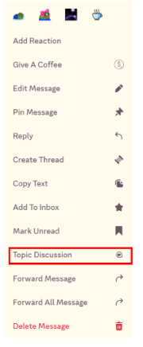
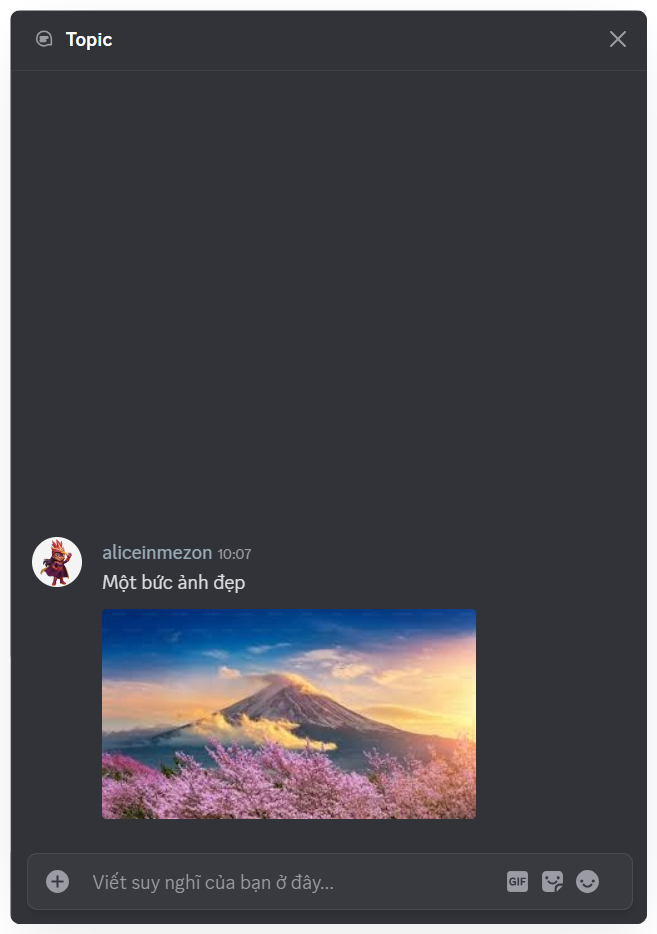

import { Steps, Step } from '@site/src/components/Steps';
import Tabs from "@theme/Tabs";
import TabItem from "@theme/TabItem";
import topicMobile001 from './images/topic-mobile-001.png';
import topicMobile002 from './images/topic-mobile-002.png';
import topicMobile003 from './images/topic-mobile-003.png';
import topicMobile004 from './images/topic-mobile-004.png';

# Thảo luận ngắn

Thảo luận ngắn in Chat cho phép tách cuộc thảo luận riêng ngay từ tin nhắn,
giúp giữ mạch trò chuyện chính liền mạch và rõ ràng hơn.

### Cách thêm Thảo luận ngắn trong đoạn chat
<Tabs>
<TabItem value="PC" label="PC">
<Steps>
<Step title="Trong **Kênh văn bản** hoặc **Chủ đề**, nhấn chuột phải vào tin nhắn.">
</Step>

<Step title="Chọn **Thảo luận chủ đề**">

</Step>

<Step title="Nhập tin nhắn trong cửa sổ **Thảo luận ngắn** để bắt đầu trao đổi">

</Step>
</Steps>

Với **Thảo luận ngắn**, bạn vừa giữ được cuộc trò chuyện chính tập trung, vừa mở rộng thảo luận chi tiết mà không sợ bị lẫn lộn.
</TabItem>
<TabItem value="mobile" label="Mobile">
<Steps>
<Step title="Trong **Kênh Văn bản** hoặc **Chủ đề**, nhấn giữ vào tin nhắn mà bạn muốn thảo luận thêm.">
</Step>

<Step title="Chọn **Thảo luận chủ đề**">

</Step>

<Step title="Nhập tin nhắn trong **cửa sổ Thảo luận ngắn** để bắt đầu trao đổi">

</Step>

<Step title="Cách xem lại **Thảo luận ngắn** đã thảo luận">

Bạn có thể dễ dàng xem lại các chủ đề đã tham gia trong Clan:

* Ngay trong khung trò chuyện, **nhấn “Xem Topic”** để mở lại nội dung và toàn bộ cuộc thảo luận liên quan.

* Hoặc truy cập **phần Thông báo → Chủ đề**, nơi hiển thị **toàn bộ các topic** mà bạn đã tham gia hoặc theo dõi trong Clan.

</Step>
</Steps>

:::success
Với **Thảo luận ngắn**, bạn vừa giữ được cuộc trò chuyện chính tập trung, vừa mở rộng thảo luận chi tiết mà không sợ bị lẫn lộn.
:::
</TabItem>
</Tabs>