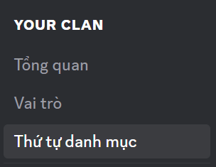

import { Steps, Step } from '@site/src/components/Steps';
import Tabs from "@theme/Tabs";
import TabItem from "@theme/TabItem";
import clanCategory001 from './images/clan-category-001.png';
import clanCategory002 from './images/clan-category-002.png';
import clanCategory003 from './images/clan-category-003.png';
import clanCategoryMobile001 from './images/clan-category-mobile-001.png';
import clanCategoryMobile002 from './images/clan-category-mobile-002.png';
import clanCategoryMobile003 from './images/clan-category-mobile-003.png';
import clanCategoryMobile004 from './images/clan-category-mobile-004.png';

# Danh mục trong Clan

Khi Clan phát triển, số lượng kênh tăng nhanh khiến việc theo dõi trở nên rối rắm. Danh mục giúp bạn nhóm các kênh liên quan, giữ mọi thứ rõ ràng và dễ tìm hơn cho mọi thành viên.

<Tabs>
<TabItem value="PC" label="PC">
### 1. Cách tạo Danh mục:

<Steps>
<Step title="Nhấn vào tên Clan của bạn sau đó chọn **Tạo danh mục.** Đảm bảo rằng bạn đã bật **Hiển thị danh mục trống**">
    
</Step>

<Step title="Nhập tên Danh mục bạn muốn phân loại và nhấn **Tạo danh mục**">

</Step>

<Step title="Danh mục mới sẽ xuất hiện ở bên trái thanh điều hướng">

</Step>

<Step title="Bạn có thể di chuyển các Kênh giữa các Danh mục bằng cách kéo thả các Kênh vào vị trí phù hợp.">
</Step>
</Steps>

:::success
Bạn có thể cài đặt tùy chỉnh thông báo của Danh mục như cách tùy chỉnh thông báo của Clan và Kênh.
:::

### **Cách sắp xếp thứ tự danh mục:**

1. Mở **Cài đặt Clan**.
2. Chọn **Thứ tự danh mục** trong menu bên trái.

3. Nhấn giữ và kéo thả các kênh theo thứ tự mong muốn.
4. Nhấn **Save Changes** để hoàn tất thao tác.

:::info
Cả **chủ Clan** và **thành viên** đều có thể thay đổi thứ tự danh mục. Tuy nhiên, bố cục này **chỉ hiển thị cho cá nhân** thực hiện thay đổi, không ảnh hưởng đến những người khác trong Clan.
:::

Danh mục giúp giảm bớt sự rối loạn thông tin, tiết kiệm thời gian tìm kiếm, và đảm bảo mọi người đều dễ dàng theo dõi đúng nội dung mình quan tâm. Với Danh mục, không gian làm việc và cộng đồng trên Mezon luôn trực quan, ngăn nắp và dễ quản lý - dù tổ chức của bạn có hàng chục hay hàng trăm kênh.

</TabItem>
<TabItem value="mobile" label="Mobile">
### Cách tạo Danh mục

<Steps>
<Step title="Nhấn vào tên Clan của bạn sau đó chọn **Tạo danh mục.** Đảm bảo rằng bạn đã bật **Hiển thị danh mục trống**">

</Step>

<Step title="Nhập **Tên danh mục** bạn muốn và nhấn Tạo">

</Step>

<Step title="Danh mục mới sẽ xuất hiện ở trong phần **Điều hướng Clan**">

</Step>
</Steps>

> Danh mục giúp giảm bớt sự rối loạn thông tin, tiết kiệm thời gian tìm kiếm, và đảm bảo mọi người đều dễ dàng theo dõi đúng nội dung mình quan tâm. Với danh mục, không gian làm việc và cộng đồng trên Mezon luôn trực quan, ngăn nắp và dễ quản lý - dù tổ chức của bạn có hàng chục hay hàng trăm kênh.

### Cách quản lý Danh mục

Để quản lý một **Danh mục**, hãy **nhấn và giữ** vào danh mục bạn muốn thao tác.

Tại đây, bạn có thể dễ dàng thực hiện các hành động sau:

* **Đánh dấu là đã đọc** – xóa thông báo chưa đọc của toàn bộ kênh trong danh mục.
* **Tắt tiếng thông báo** – ngừng nhận thông báo từ các kênh thuộc danh mục này.
* **Cài đặt thông báo** – tùy chỉnh cách nhận thông báo theo ý bạn.
* **Chỉnh sửa danh mục** – thay đổi tên danh mục.
* **Tạo kênh mới** – thêm kênh văn bản, thoại hoặc phát trực tiếp vào danh mục.
* **Xóa danh mục** – loại bỏ danh mục cùng các kênh bên trong.
* **Sao chép ID Clan** – sao chép mã định danh để sử dụng cho mục đích kỹ thuật hoặc quản trị.

:::tip
_Giúp bạn quản lý cấu trúc Clan một cách nhanh chóng và trực quan ngay trên giao diện di động._
:::
</TabItem>
</Tabs>
