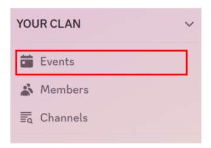
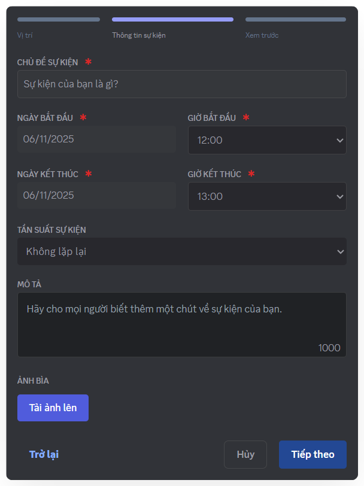
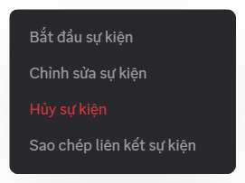

import creatingAndManagingEvents002 from './images/creating-and-managing-events-002.png';

# Tạo & Quản lý Sự kiện
Sự kiện là nhịp kết nối của cộng đồng – từ họp nhóm, workshop đến các buổi giao lưu nội bộ. Trên Mezon, bạn có thể tạo và quản lý mọi hoạt động này dễ dàng chỉ với vài bước.

### Cách tạo Sự kiện

<Steps>
<Step title="Ở thanh điều hướng bên trái, chọn **Events**.">

</Step>

<Step title="Chọn **địa điểm** tổ chức sự kiện">

Khi tạo sự kiện trên Mezon, bạn có thể lựa chọn địa điểm phù hợp:

* **Kênh thoại** – Tổ chức sự kiện ngay trong kênh voice có sẵn của Clan, tận dụng tính năng voice, video và screen share của Mezon.
  * Trong mục **Khán giả là ai**, nếu **KHÔNG** chọn bất kì kênh nào, sự kiện sẽ trở thành **Sự kiện Clan**, giúp tất cả thành viên trong Clan đều có thể thấy được và tham gia.
  * Trong mục **Khán giả là ai**, nếu chọn một kênh, sự kiện sẽ trở thành **Sự kiện Kênh**, sẽ chỉ thành viên của kênh được chọn mới có thể thấy và tham gia.
* **Nơi khác** – Nếu sự kiện diễn ra ngoài đời thực hoặc ở nền tảng khác, bạn có thể thêm link hoặc địa chỉ để mọi người dễ dàng theo dõi và tham gia.&#x20;
* **Tạo sự kiện riêng tư** – Tạo phòng họp trực tuyến, có thể chia sẻ cho bất kỳ ai — kể cả người không dùng Mezon.
  * Không cần đăng nhập, chỉ cần click link là tham gia ngay.
  * Hoàn toàn miễn phí, không giới hạn thời lượng.
  * Đầy đủ tính năng: voice, video, chat, chia sẻ màn hình.
</Step>

<Step title="Nhập các thông tin về sự kiện và chọn **Tiếp theo**">

:::warning
Giới hạn dung lượng tối đa của Ảnh bìa sự kiện là 1Mb
:::
</Step>

<Step title="Kiểm tra lại nội dung của Sự kiện và nhấn **Tạo**">

</Step>

<Step title="Sự kiện của bạn sẽ hiển thị trong mục Sự kiện ở thanh điều hướng bên trái.">

</Step>

<Step title="Bạn có thể bắt đầu sự kiện ngay lập tức, chỉnh sửa, hủy, hoặc sao chép liên kết sự kiện tại menu mở rộng '...'">

</Step>
</Steps>