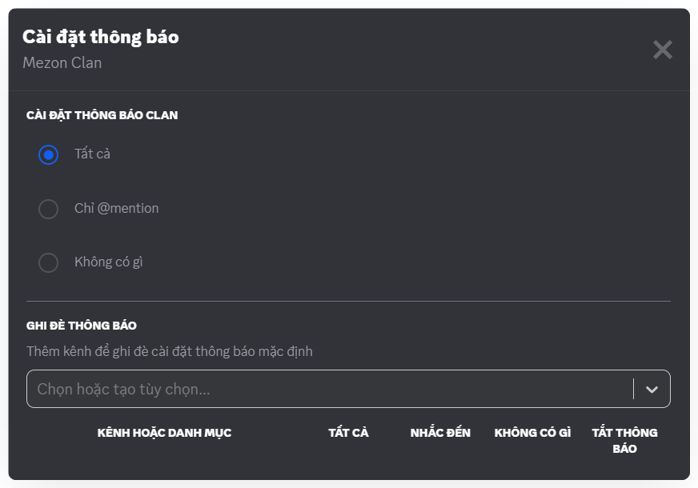
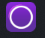
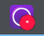

import Tabs from "@theme/Tabs";
import TabItem from "@theme/TabItem";
import managingNotificationsInAClan001 from "./images/managing-notifications-in-a-clan-001.png";
import managingNotificationsInAClan002 from "./images/managing-notifications-in-a-clan-002.png";
import managingNotificationsInAClanMobile001 from "./images/managing-notifications-in-a-clan-mobile-001.png";
import managingNotificationsInAClanMobile002 from "./images/managing-notifications-in-a-clan-mobile-002.png";

# Quản lý thông báo trong Clan

Khi mới tham gia, bạn có thể bị “ngợp” với lượng thông báo dồn dập. Đừng lo, bạn có thể điều chỉnh rất dễ dàng

<Tabs>
<TabItem value="PC" label="PC">
### Cách quản lý thông báo trong Clan

1. Click chuột phải vào biểu tượng Clan.
2. Chọn **Cài đặt thông báo**.
3. Lựa chọn:
   - **Tất cả** → Nhận tất cả tin nhắn.
   - **Chỉ @mention** → Chỉ khi ai đó nhắc đến bạn.
   - **Không có gì** → Tắt thông báo hoàn toàn.

:::warning
Nếu tham gia nhiều Clan, hãy để hầu hết ở chế độ Only @mention, như vậy bạn vừa không bỏ lỡ điều quan trọng, vừa không bị “ting ting” suốt ngày.
:::

Ngoài ra, bạn có thể quản lý thông báo chi tiết của từng Kênh trong Clan bằng cách nhấn vào tên Clan, chọn **Cài đặt thông báo**.

:::tip
Huy hiệu thông báo: Ở thanh Taskbar, bạn có thể nhìn nhanh huy hiệu thông báo để biết mình có thông báo nào không:

 Chỉ có Logo Mezon: Không có thông báo nào.

 Có chấm đỏ cạnh Logo Mezon: Có thông báo.

 Có số cạnh Logo Mezon: Có ai đó mention bạn. Số lượng mention được hiển thị.
:::

</TabItem>
<TabItem value="mobile" label="Mobile">
### Cách quản lý thông báo trong Clan

1. Nhấn vào tên Clan của bạn
2. Chọn **biểu tượng chuông thông báo** 
3. Lựa chọn:

   - **Tất cả tin nhắn** – Nhận thông báo cho mọi tin nhắn trong Clan.
   - **Chỉ @mention** – Chỉ nhận khi bạn được nhắc đến.
   - **Không có gì** – Tắt toàn bộ thông báo tin nhắn.

   **Tùy chọn tắt tiếng**

   - **@everyone và @here** – Tắt thông báo khi có ping toàn Clan.
   - **@mention tất cả vai trò** – Tắt thông báo khi vai trò của bạn bị nhắc đến.
   - **Điểm nổi bật** – Ngừng nhận cập nhật về hoạt động của bạn bè trong Clan.
   - **Sự kiện mới** – Tắt thông báo khi có sự kiện được tạo.
   - **Thông báo đẩy di động** – Ngừng hiển thị thông báo của Clan trên thiết bị của bạn.

   **Ghi đè thông báo**

   - **Thêm tất cả kênh vào danh mục** – Gộp nhanh các kênh để áp dụng cùng một cài đặt thông báo.

  

:::tip
Nếu tham gia nhiều Clan, hãy để hầu hết ở chế độ Only @mention, như vậy bạn vừa không bỏ lỡ điều quan trọng, vừa không bị “ting ting” suốt ngày.
:::

</TabItem>
</Tabs>
