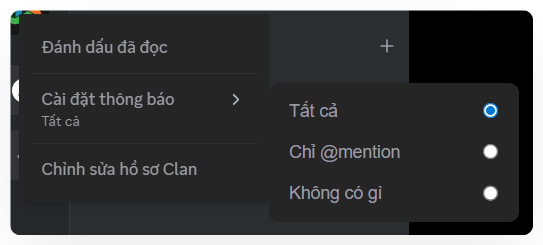
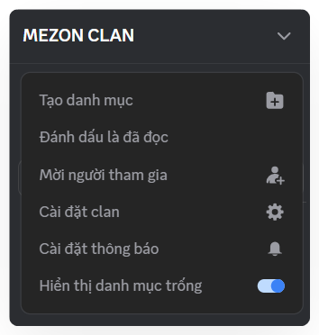

# Quản lý thông báo trong Clan
Khi mới tham gia, bạn có thể bị “ngợp” với lượng thông báo dồn dập. Đừng lo, bạn có thể điều chỉnh rất dễ dàng

### Cách quản lý thông báo trong Clan

1. Click chuột phải vào biểu tượng Clan.
2. Chọn **Cài đặt thông báo**.
3. Lựa chọn:
   * **Tất cả** → Nhận tất cả tin nhắn.
   * **Chỉ @mention** → Chỉ khi ai đó nhắc đến bạn.
   * **Không có gì** → Tắt thông báo hoàn toàn.

:::warning
Nếu tham gia nhiều Clan, hãy để hầu hết ở chế độ Only @mention, như vậy bạn vừa không bỏ lỡ điều quan trọng, vừa không bị “ting ting” suốt ngày.
:::

Ngoài ra, bạn có thể quản lý thông báo chi tiết của từng Kênh trong Clan bằng cách nhấn vào tên Clan, chọn **Cài đặt thông báo**.&#x20;

:::tip
Huy hiệu thông báo: Ở thanh Taskbar, bạn có thể nhìn nhanh huy hiệu thông báo để biết mình có thông báo nào không:

 Chỉ có Logo Mezon: Không có thông báo nào.

 Có chấm đỏ cạnh Logo Mezon: Có thông báo.

 Có số cạnh Logo Mezon: Có ai đó mention bạn. Số lượng mention được hiển thị.
:::