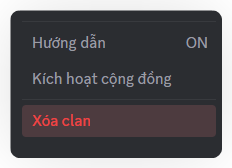
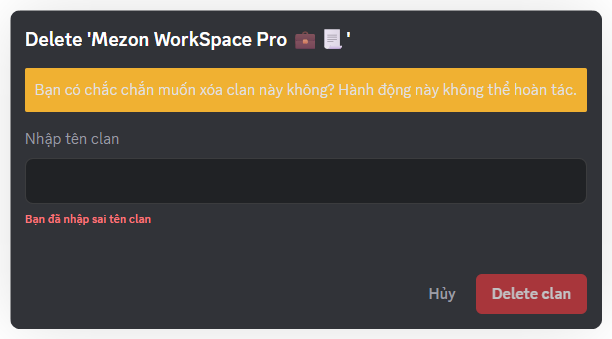

import { Steps, Step } from '@site/src/components/Steps';

# Xóa Clan
Trong trường hợp Clan không còn được sử dụng hoặc bạn muốn dừng hoạt động cộng đồng, bạn có thể xóa vĩnh viễn Clan.

:::danger   
#### _<mark style={{ color: 'red' }}>**Lưu ý**</mark>**: hành động này không thể hoàn tác và toàn bộ dữ liệu, kênh và nội dung trong Clan sẽ bị xóa theo.**_
:::

### **Cách xóa Clan**

<Steps>
<Step title="Ở menu bên trái, chọn **Xóa Clan**">

</Step>

<Step title="Nhập lại tên Clan để xác nhận">

</Step>

<Step title="Nhấn **Xóa Clan**">
</Step>
</Steps>

:::danger
Sau khi xóa, Clan và toàn bộ dữ liệu sẽ bị mất vĩnh viễn, bạn không thể khôi phục.
:::