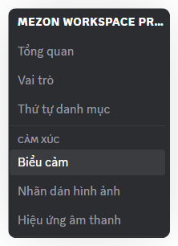
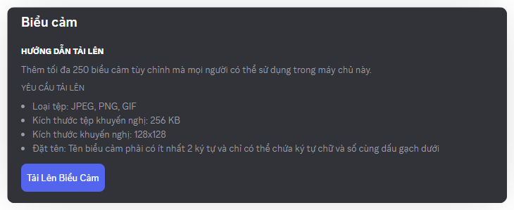
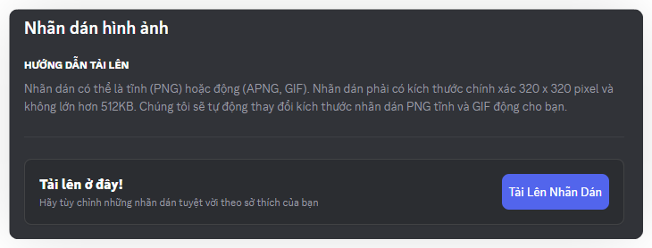
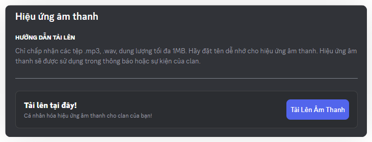
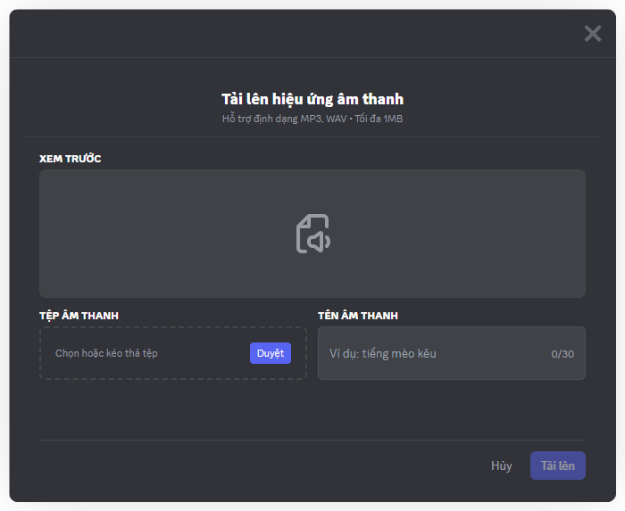

import Tabs from "@theme/Tabs";
import TabItem from "@theme/TabItem";
import { Steps, Step } from '@site/src/components/Steps';
import emojiImageAndVoiceStickersMobile001 from "./images/emoji-image-and-voice-stickers-mobile-001.png";
import emojiImageAndVoiceStickersMobile002 from "./images/emoji-image-and-voice-stickers-mobile-002.png";
import emojiImageAndVoiceStickersMobile003 from "./images/emoji-image-and-voice-stickers-mobile-003.png";
import emojiImageAndVoiceStickersMobile004 from "./images/emoji-image-and-voice-stickers-mobile-004.png";
import emojiImageAndVoiceStickersMobile005 from "./images/emoji-image-and-voice-stickers-mobile-005.png";
import emojiImageAndVoiceStickersMobile006 from "./images/emoji-image-and-voice-stickers-mobile-006.png";
import emojiImageAndVoiceStickersMobile007 from "./images/emoji-image-and-voice-stickers-mobile-007.png";

# Biểu tượng, Nhãn dán hình ảnh/âm thanh
Trong giao tiếp trực tuyến, chúng giúp tạo không gian trò chuyện vui nhộn, gần gũi và mang đậm cá tính cộng đồng.

<Tabs>
<TabItem value="PC" label="PC">
### <mark style={{backgroundColor: "$info"}}>**Cách thêm Biểu tượng cảm xúc**</mark>

<Steps>
<Step title="Trong menu bên trái, chọn Biểu tượng cảm xúc, nhãn dán hình ảnh hoặc nhãn dán âm thanh  theo nhu cầu của bạn">

</Step>

<Step title="Nhấn Tải lên Biểu tượng cảm xúc/Nhãn dán hình ảnh/âm thanh">

* Tối đa có thể tải lên 250 Biểu tượng cảm xúc mỗi Clan
* Loại tệp: JPEG, PNG, GIF
* Kích thước tệp tối đa: 256 KB
* Kích thước khuyến nghị: 128x128
* Đặt tên: Phải có ít nhất 2 ký tự và chỉ có thể chứa ký tự chữ và số cùng dấu gạch dưới

* Tối đa có thể tải lên 250 Nhãn dán hình ảnh mỗi Clan
* Loại tệp: PNG, APGN, GIF
* Kích thước tệp tối đa: 512 KB
* Kích thước khuyến nghị: 320x320
* Đặt tên: Phải có ít nhất 2 ký tự và chỉ có thể chứa ký tự chữ và số cùng dấu gạch dưới

* Tối đa có thể tải lên 250 Nhãn dán âm thanh mỗi Clan
* Loại tệp: MP3, WAV
* Kích thước tệp tối đa: 1 MB
* Đặt tên: Phải có ít nhất 2 ký tự và chỉ có thể chứa ký tự chữ và số cùng dấu gạch dưới
</Step>

<Step title="Nhấn **Duyệt**  để chọn biểu tượng cảm xúc/nhãn dán hình ảnh/âm thanh bạn muốn thêm và nhấn **Tải lên** để hoàn tất.">

Bạn có thể tích chọn "Đây là sản phẩm bán" khi tải lên Biểu tượng cảm xúc/Nhãn dán hình ảnh để yêu cầu người dùng phải mua bằng Mezon Đồng để có thể sử dụng. Hiện tại, giá mặc định của khi chọn mục này là 500 Mezon Đồng mỗi Biểu tượng cảm xúc/Nhãn dán hình ảnh.
</Step>
</Steps>

> _Mỗi biểu tượng cảm xúc hay nhãn dán là một mảnh ghép của văn hóa nội bộ, giúp cộng đồng gắn bó và dễ dàng nhận diện.Thành viên có thể tự do đề xuất và thiết kế biểu tượng cảm xúc, khiến mọi cuộc trò chuyện thêm sinh động. Ngoài ra cũng có thể biểu đạt cảm xúc nhanh, ngắn gọn và hài hước - đúng với tinh thần “Chơi cùng nhau, làm việc cùng nhau” mà Mezon hướng tới._

</TabItem>
<TabItem value="mobile" label="Mobile">
### **Cách thêm** Biểu tượng cảm xúc & Nhãn dán hình ảnh & Nhãn dán âm thanh 

<Steps>
<Step title="Trong phần cài đặt tổng quan, lựa chọn Biểu tượng cảm xúc/ nhãn dán hình ảnh/ nhãn dán âm thanh theo nhu cầu của bạn">

</Step>

<Step title="Nhấn **Tải lên** biểu tượng cảm xúc/ Tải lên nhãn dán hình ảnh/ Tải lên nhãn dán âm thanh">

* Tối đa có thể tải lên 250 Biểu tượng cảm xúc mỗi Clan
* Loại tệp: JPEG, PNG, GIF
* Kích thước tệp tối đa: 256 KB
* Kích thước khuyến nghị: 128x128
* Đặt tên: Phải có ít nhất 2 ký tự và chỉ có thể chứa ký tự chữ và số cùng dấu gạch dưới

* Tối đa có thể tải lên 250 Nhãn dán hình ảnh mỗi Clan
* Loại tệp: PNG, APGN, GIF
* Kích thước tệp tối đa: 512 KB
* Kích thước khuyến nghị: 320x320
* Đặt tên: Phải có ít nhất 2 ký tự và chỉ có thể chứa ký tự chữ và số cùng dấu gạch dưới

* Tối đa có thể tải lên 250 Nhãn dán âm thanh mỗi Clan
* Loại tệp: MP3, WAV
* Kích thước tệp tối đa: 1 MB
* Đặt tên: Phải có ít nhất 2 ký tự và chỉ có thể chứa ký tự chữ và số cùng dấu gạch dưới
</Step>

<Step title="Chọn biểu tượng cảm xúc/ nhãn dán hình ảnh/ nhãn dán âm thanh mà bạn muốn tải lên">

</Step>

<Step title="**Điều chỉnh kích thước và đặt tên** cho biểu tượng cảm xúc/ nhãn dán hình ảnh/ nhãn dán âm thanh. Nhấn **tải lên** để hoàn thành">

</Step>
</Steps>

> _Mỗi biểu tượng cảm xúc hay nhãn dán là một mảnh ghép của văn hóa nội bộ, giúp cộng đồng gắn bó và dễ dàng nhận diện. Thành viên có thể tự do đề xuất và thiết kế biểu tượng cảm xúc, khiến mọi cuộc trò chuyện thêm sinh động. Ngoài ra cũng có thể biểu đạt cảm xúc nhanh, ngắn gọn và hài hước - đúng với tinh thần “Chơi cùng nhau, làm việc cùng nhau” mà Mezon hướng tới._

</TabItem>
</Tabs>

