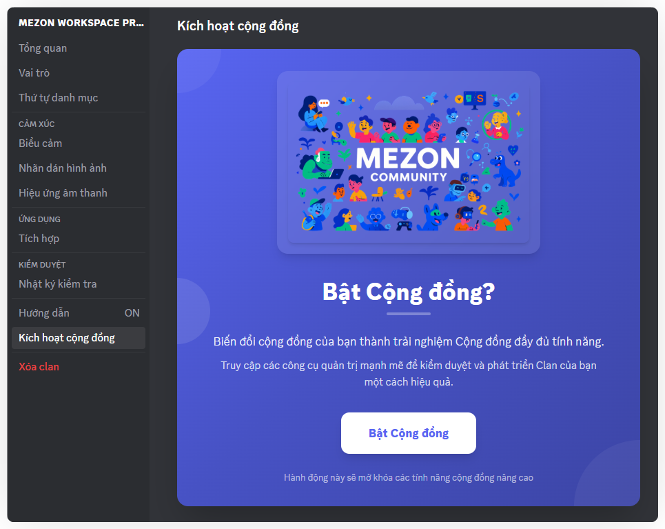

import { Steps, Step } from '@site/src/components/Steps';

# Kích hoạt cộng đồng
Kích hoạt và phát triển Clan thành một cộng đồng công khai.

Khi bạn bật chế độ **Cộng đồng**, Clan sẽ không chỉ là một nhóm riêng tư nữa, mà trở thành **một cộng đồng mở rộng và dễ tiếp cận hơn**.

* Clan của bạn sẽ có **link tùy chỉnh cố định** (ví dụ: mezon.ai/clan/ten-clan), dễ nhớ và dễ chia sẻ cho mọi người.
* Clan sẽ được hiển thị trên trang [**Discover**](https://mezon.ai/clans/), nơi người dùng Mezon có thể tìm kiếm, xem thông tin và tham gia.
* Bạn có thêm các công cụ quản lý cộng đồng, giúp thu hút thành viên mới, tổ chức sự kiện, và phát triển Clan thành một không gian mở chuyên nghiệp.

Nếu bạn muốn Clan của mình trở thành một cộng đồng “có thương hiệu”, được nhiều người biết đến và dễ dàng thu hút thành viên mới, hãy bật **Community Mode** ngay hôm nay.

### Hướng dẫn kích hoạt và thiết lập Cộng đồng Mezon

Thực hiện các bước sau để kích hoạt và cấu hình không gian Cộng đồng cho Clan của bạn.

<Steps>
<Step title="Kích hoạt Cộng đồng">

Tại menu bên trái, tìm và chọn "**Bật Cộng đồng"**.

Đọc thông tin giới thiệu, sau đó nhấp vào nút "**Enable Community**" ở cuối màn hình để xác nhận.
</Step>

<Step title="Tùy chỉnh thông tin Cộng đồng">

Sau khi kích hoạt, bạn sẽ được đưa đến trang cấu hình:

* **Banner Cộng đồng**: Nhấp vào "**Tải lên Banner**" để tải lên hình ảnh đại diện cho cộng đồng của bạn.
* **Mô tả Cộng đồng**: Nhập một đoạn mô tả ngắn gọn (tối đa 300 ký tự) giới thiệu về cộng đồng của bạn.
* **Về Cộng đồng (Giới thiệu chi tiết)**: Hãy viết đoạn ngắn (tối đa 100 ký tự) giới thiệu về Clan, giá trị và điều làm nên sự đặc biệt của nó.
* **URL Tùy chỉnh**: Nhập một tên tùy chỉnh (chữ thường, số, gạch nối) để tạo URL dễ nhớ cho cộng đồng của bạn.

Ví dụ: Nhập my-awesome-community để có [mezon.ai/clans/clan/my-awesome-community](http://mezon.ai/clans/clan/my-awesome-community).

:::warning
Giới hạn dung lượng tối đa của Community Banner là 10Mb
:::
</Step>

<Step title="Kích hoạt & Lưu">

Sau khi điền đầy đủ thông tin, nhấp vào nút "**Bật & Lưu**" ở cuối trang.
</Step>
</Steps>

Như vậy, bạn đã hoàn tất việc bật chế độ Cộng đồng cho Clan của bạn. Mọi người trên internet giờ đều đã có thể tham gia Clan của bạn một cách tự do!