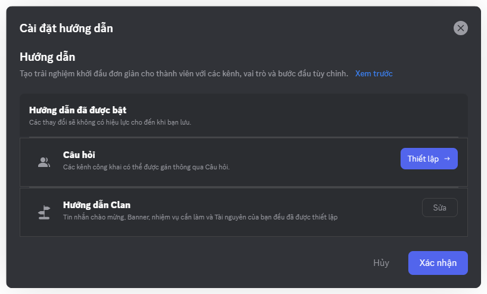
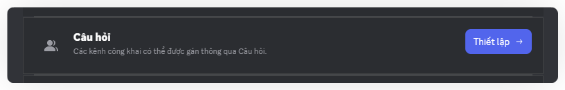
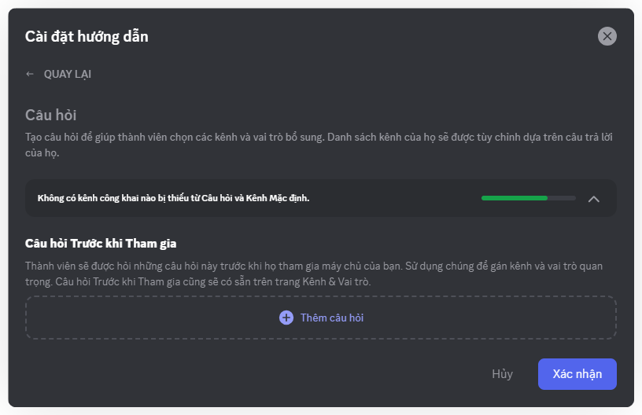
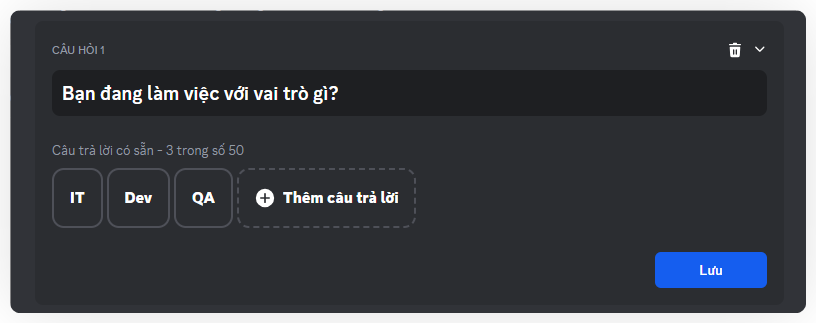
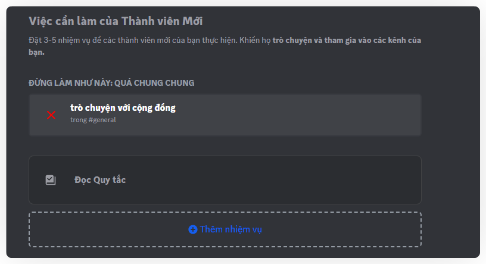
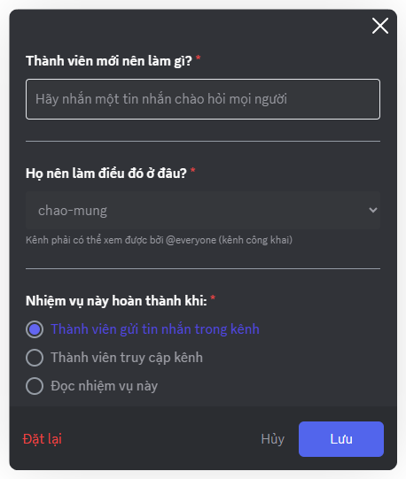
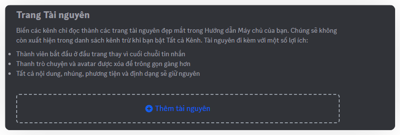
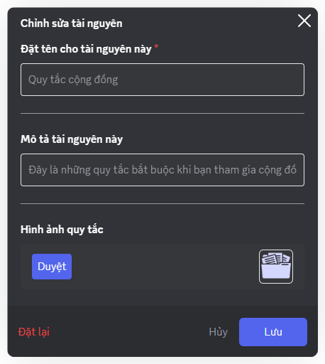
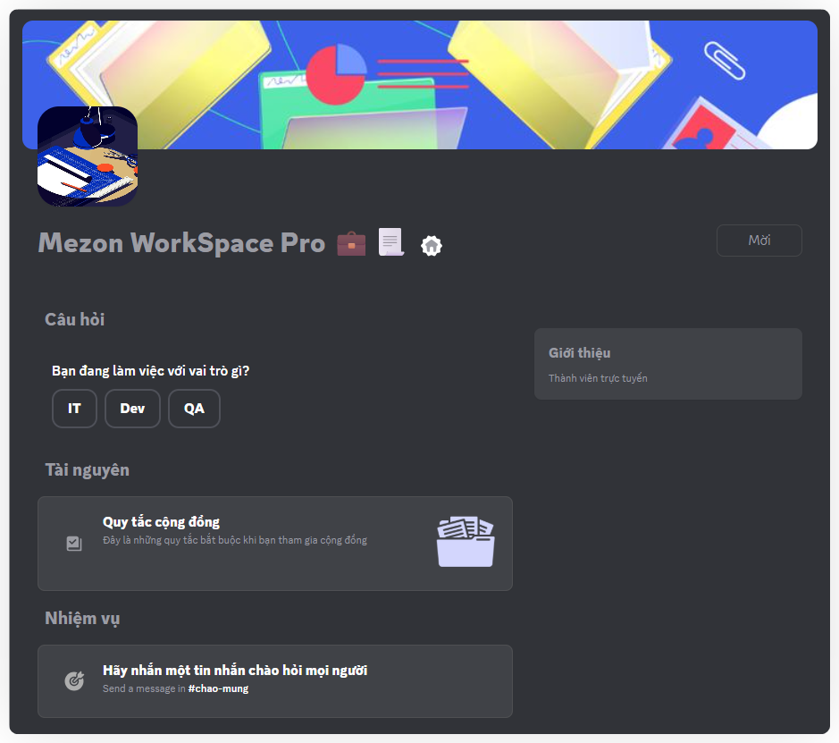

import { Steps, Step } from '@site/src/components/Steps';

# Hướng dẫn thành viên mới
Thiết lập trải nghiệm chào đón thành viên mới.

## **1. Kích Hoạt Hướng Dẫn**

<Steps>
<Step title="Trong danh sách các tùy chọn, chọn **Hướng Dẫn**">
</Step>

<Step title="Tại đây, bạn sẽ thấy một màn hình giới thiệu về Onboarding. Nhấp vào nút **Bật hướng dẫn** để kích hoạt tính năng này.">

</Step>

<Step title="Sau khi kích hoạt, **một cửa sổ Cài đặt hướng dẫn** sẽ xuất hiện">
_Bạn có thể bắt đầu thiết lập chi tiết._
</Step>
</Steps>

## **2. Cấu Hình Cài Đặt Hướng Dẫn**

Sau khi kích hoạt, bạn sẽ có hai phần chính để cấu hình trải nghiệm Hướng dẫn người mới: **Câu hỏi và Hướng dẫn Clan.**

Trong cửa sổ Cài đặt hướng dẫn, bạn sẽ thấy thông báo "**Hướng dẫn người mới đã bật**".

### **2.1. Thiết Lập Câu hỏi**

Phần này cho phép bạn tạo các câu hỏi để thành viên mới trả lời.

Cách làm: Nhấp vào nút "**Thiết lập**" bên cạnh mục Câu hỏi.

Tại đây bạn có thể đặt ra các câu hỏi và các câu trả lời (nếu có) để định hướng thành viên mới, giúp họ chọn lựa kênh phù hợp với sở thích hoặc vai trò của mình.

Nhấn vào "Thêm câu hỏi" để bắt đầu thiết lập từng câu hỏi cho người mới vào kênh. Những câu hỏi này có thể được xem như một hướng dẫn tương tác, giúp thành viên mới làm quen với cách hoạt động của Clan. Chính vì vậy, không có câu trả lời đúng hay sai, mà chỉ có những thông tin hữu ích.&#x20;

### 2.2. Thiết Lập Hướng Dẫn Clan

Đây là nơi bạn xây dựng một hướng dẫn chào mừng hoàn chỉnh cho thành viên mới, bao gồm tin nhắn chào mừng, biểu ngữ, các nhiệm vụ cần làm và tài nguyên hữu ích.

Cách làm: Nhấp vào nút "**Sửa**" bên cạnh mục Hướng dẫn Clan.

#### **New Member To Do's**

Đây là danh sách 3-5 nhiệm vụ bạn muốn thành viên mới thực hiện để khuyến khích họ tương tác và tham gia vào các kênh.

:::info
Lưu ý: Tránh các nhiệm vụ quá chung chung như "chat với cộng đồng".
:::

**Bước 1: Thêm nhiệm vụ**

Nhấp vào "**Add a task**"

**Bước 2: Thiết lập nhiệm vụ**

Thành viên mới nên làm gì?: Nhập mô tả nhiệm vụ (ví dụ: "Giới thiệu bản thân trong kênh #chao-hoi").

Họ nên làm điều đó ở đâu?: Chọn kênh mà thành viên cần thực hiện nhiệm vụ này (chỉ các kênh công khai).

Nhiệm vụ này hoàn thành khi: Chọn điều kiện để nhiệm vụ được đánh dấu hoàn thành, chọn 1 trong 3 lựa chọn: Thành viên gửi tin nhắn trong kênh, Thành viên truy cập kênh, hoặc Đọc nhiệm vụ này).

Nhấp "**Lưu"** để lưu nhiệm vụ.

#### **Resource Pages**

Resource Pages cho phép bạn biến các kênh chỉ đọc thành các trang tài nguyên chuyên nghiệp trong Hướng dẫn Clan, giúp thành viên mới dễ dàng tiếp cận thông tin quan trọng.

**Cách Tạo và Chỉnh Sửa Resource Page**

**Bước 1: Tạo Resource Page**

Trong phần Hướng dẫn Clan, kéo xuống mục Resource Pages.

Nhấp vào "**Add a resource**".

Chọn một kênh chỉ đọc hiện có bạn muốn biến thành trang tài nguyên và nhấp **Create**.

**Bước 2: Chỉnh Sửa Thông Tin Resource Page**

Sau khi thêm, nhấp vào tài nguyên để mở cửa sổ "**Edit Resources**".

* Đặt tên hiển thị cho trang (ví dụ: "Quy Tắc Clan").
* Give this resource a description: Đây chính là nơi bạn ghi nội dung của trang này. Hãy ghi chi tiết điều bạn muốn truyền tải tới thành viên mới.&#x20;
* Rules Image: Tải lên hình ảnh minh họa bằng cách nhấp "**Duyệt**".
* Nhấp "**Lưu**" để lưu thay đổi.

Sau khi hoành thành các bước, phần Hướng dẫn thành viên mới sẽ được hiển thị ở trang "Hướng dẫn" ngay dưới tên của Clan:

:::warning
Giới hạn dung lượng tối đa của Resource Page Rules Image là 10Mb
:::

### **3. Vô Hiệu Hóa Onboarding**

Nếu bạn không muốn sử dụng tính năng Onboarding nữa, bạn có thể dễ dàng vô hiệu hóa nó:

Bước 1: Truy cập lại vào **Cài đặt Clan > Hướng dẫn**.

Bước 2: Nhấp vào nút "**Tắt hướng dẫn**" màu đỏ ở góc trên bên phải màn hình.

