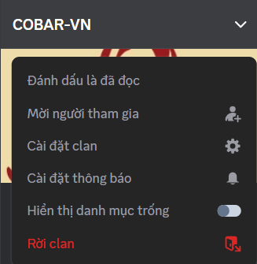

# Tham gia & Khám phá Clan

### Cách tham gia một Clan

Bạn có thể khám phá Clan mới theo 2 cách:

1. **Nút Khám phá**  ngay trong ứng dụng hoặc khám phá trực tiếp qua [**Website Clans**](https://mezon.ai/clans/): Nơi tổng hợp thông tin của tất cả Clan sôi nổi nhất của Mezon.
2. **Liên kết mời:** nhận từ bạn bè, đồng đội hoặc quản trị viên.

Chỉ cần nhấn “Tham gia” là bạn đã chính thức trở thành một phần của cộng đồng đó.

Tham khảo 1 số Clan trải nghiệm của Mezon nhé!

* [Liên kết mời đến Clan Học Sinh](https://mezon.ai/invite/1971118566472159232).
* [Liên kết mời đến Clan Game Thủ](https://mezon.ai/invite/1971122683512885248).
* [Liên kết mời đến Clan Doanh Nghiệp](https://mezon.ai/invite/1971125963139846144).

:::warning
Mỗi cá nhân chỉ có thể tham gia tối đa 50 Clan trong một thời điểm.
:::

### **Rời khỏi Clan**

* Nếu không còn muốn tham gia, bạn có thể chọn **Rời Clan** ngay trong phần cài đặt Clan.
* Khi rời đi, toàn bộ lịch sử tin nhắn và quyền truy cập vào các kênh của Clan đó sẽ bị xóa khỏi tài khoản của bạn.