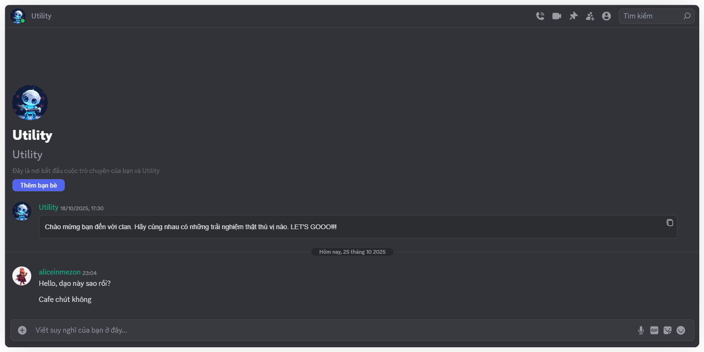

import Tabs from "@theme/Tabs";
import TabItem from "@theme/TabItem";
import communicationAndConnectionMobile001 from "./images/communication-and-connection-mobile-001.png";
import communicationAndConnectionMobile007 from "./images/communication-and-connection-mobile-007.png";
import communicationAndConnectionMobile008 from "./images/communication-and-connection-mobile-008.png";

# Giao tiếp và kết nối
Mezon giúp bạn giữ liên lạc dễ dàng, từ tin nhắn cá nhân 1-1 đến nhóm nhỏ với bạn bè hoặc đồng đội, trong môi trường riêng tư, an toàn và đồng bộ mọi nền tảng.

<Tabs>
<TabItem value="PC" label="PC">

**Các tính năng chính:**

* \
  **Nhắn tin đa phương tiện**: Gửi văn bản, biểu tượng cảm xúc, nhãn dán, hình ảnh, video, file, ghi âm.
* \
  **Ghim tin nhắn quan trọng**: Lưu lại những thông tin cần thiết để dễ tìm lại.
* \
  **Nhóm chat nhỏ**: Tạo nhóm tối đa 10 người, gắn ảnh đại diện, quản lý tên nhóm, thêm/bớt thành viên.
* \
  **Gọi thoại và gọi Video:** Trò chuyện bằng giọng nói hoặc hình ảnh trực tiếp ngay trên Mezon.
  * Thực hiện cuộc gọi thoại hoặc video 1-1, hoặc trong nhóm chat nhỏ.
  * Bật/tắt micro, camera tùy ý
  * Chia sẻ màn hình trong cuộc gọi
  * Tín hiệu ổn định, hỗ trợ HD Video & Âm thanh độ trễ thấp.
*   \
    Tìm kiếm: Tìm kiếm tin nhắn trong cuộc trò chuyện.

    Một số tùy chọn tìm kiếm nâng cao có thể tham khảo tại: [**Tìm kiếm**](../clan/create-your-own-clan/manage-clan/clan-structure/channels/text-channel/search).

:::tip
Khi được gọi thoại và gọi video giữa 2 cá nhân, điện thoại hoặc máy tính của bạn sẽ đổ chuông đó!
:::

**Ưu điểm của trao đổi trực tuyền qua Mezon:**

* **Miễn phí hoàn toàn**: Tất cả các tính năng giao tiếp và kết nối trên Mezon **hoàn toàn miễn phí** và **không hề bị giới hạn rào cản** nào.&#x20;
* **Quyền riêng tư & an toàn**: Chỉ nhắn tin được với người đã kết bạn hoặc cùng chung ít nhất một Clan, tránh spam và giữ không gian riêng tư.
* **Đồng bộ xuyên nền tảng**: Tin nhắn luôn cập nhật trên Web, Máy tính và Điện thoại, không bỏ lỡ bất kỳ thông tin nào.
* **Nâng cấp lên Clan**: Khi nhóm trở nên sôi động, có thể nâng cấp thành Clan để sử dụng nhiều kênh, quyền quản trị, Bots và Apps mở rộng. \[[Tìm hiểu Clan là gì?](../clan/what-is-clan)\]
</TabItem>
<TabItem value="mobile" label="Mobile">

**Các tính năng chính:**

* \
  **Nhắn tin đa phương tiện**: Gửi văn bản, biểu tượng cảm xúc, nhãn dán, hình ảnh, video, file, ghi âm.
* \
  **Ghim tin nhắn quan trọng**: Lưu lại những thông tin cần thiết để dễ tìm lại.
* \
  **Nhóm chat nhỏ**: Tạo nhóm tối đa 10 người, gắn ảnh đại diện, quản lý tên nhóm, thêm/bớt thành viên.
* \
  **Gọi thoại và gọi Video:** Trò chuyện bằng giọng nói hoặc hình ảnh trực tiếp ngay trên Mezon.
  * Thực hiện cuộc gọi thoại hoặc video 1-1, hoặc trong nhóm chat nhỏ.&#x20;
  * Bật/tắt micro, camera tùy ý
  * Chia sẻ màn hình trong cuộc gọi
  * Tín hiệu ổn định, hỗ trợ HD Video & Âm thanh độ trễ thấp.

:::tip
Khi được gọi thoại và gọi video giữa 2 cá nhân, điện thoại hoặc máy tính của bạn sẽ đổ chuông đó!
:::

*   

    Khi nhấn vào tên của người bạn đang trò chuyện hoặc nhóm trò chuyện trên điện thoại, bạn có thể:

    * **Tìm kiếm tin nhắn** trong cuộc trò chuyện.
    * **Điều chỉnh cài đặt thông báo** cho cuộc trò chuyện.
    * **Xem danh sách thành viên** (trong nhóm trò chuyện, mọi thành viên đều có thể thêm người mới, nhưng chỉ trưởng nhóm mới có quyền xóa thành viên).
    * **Xem nội dung đa phương tiện** đã chia sẻ, bao gồm ảnh và video.
    * **Xem các tệp đã gửi** trong cuộc trò chuyện.
    * **Xem các tin nhắn được ghim** để dễ dàng theo dõi nội dung quan trọng.
* **Chế độ Buzz**\
  Nhấn vào **dấu ba chấm** ở góc trên cùng bên phải trong khung hội thoại, sau đó nhập nội dung tin nhắn để **gửi thông báo rung**, giúp thu hút sự chú ý của mọi người trong cuộc trò chuyện — **kể cả khi họ đã tắt thông báo**.

### **Ưu điểm của trao đổi trực tuyền qua Mezon**

* **Miễn phí hoàn toàn**: Tất cả các tính năng giao tiếp và kết nối trên Mezon **hoàn toàn miễn phí** và **không hề bị giới hạn rào cản** nào.&#x20;
* **Quyền riêng tư & an toàn**: Chỉ nhắn tin được với người đã kết bạn hoặc cùng chung ít nhất một Clan, tránh spam và giữ không gian riêng tư.
* **Đồng bộ xuyên nền tảng**: Tin nhắn luôn cập nhật trên Web, Máy tính và Điện thoại, không bỏ lỡ bất kỳ thông tin nào.
* **Nâng cấp lên Clan**: Khi nhóm trở nên sôi động, có thể nâng cấp thành Clan để sử dụng nhiều kênh, quyền quản trị, Bots và Apps mở rộng. [[Tìm hiểu Clan là gì?](../clan/what-is-clan)]
</TabItem>
</Tabs>