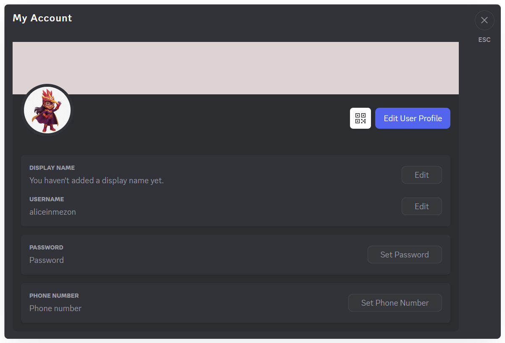
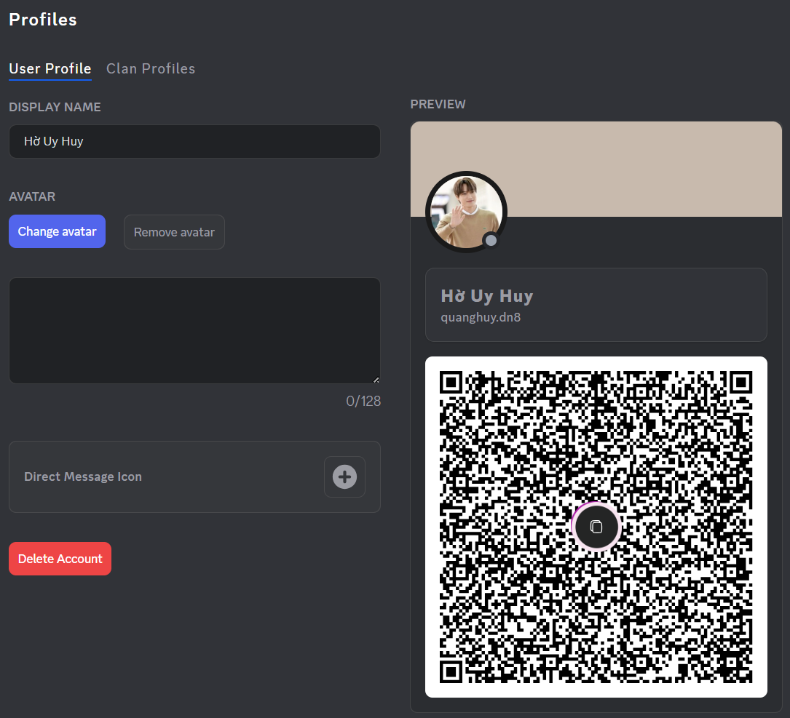
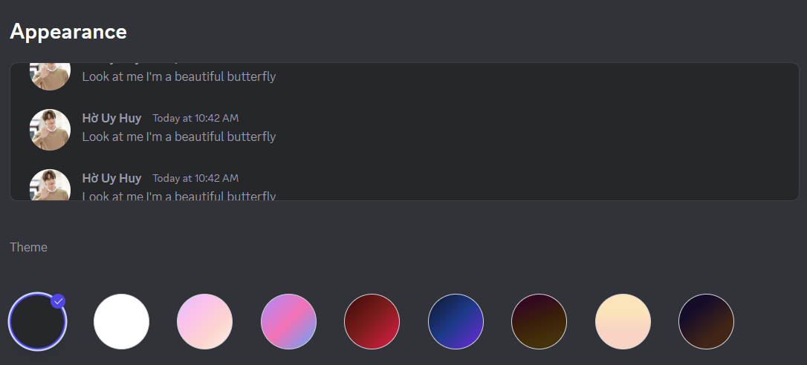
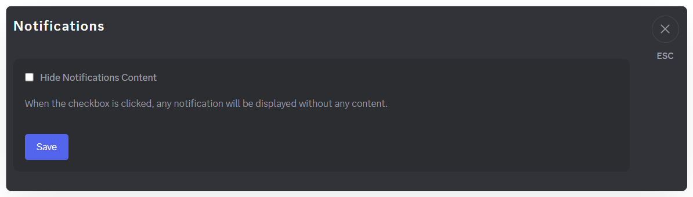
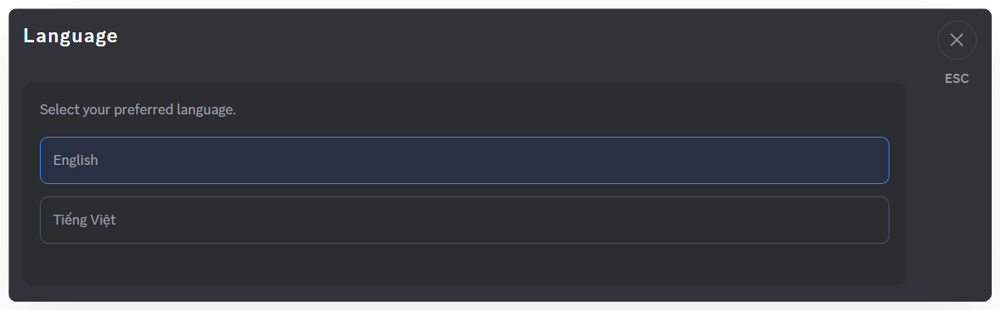

# Personalization Settings
Everyone wants a communication space that reflects their own style. With Mezon, you can customize your profile, interface, language, and notifications - creating a version of Mezon that’s uniquely you

In your **Personal Settings**, you’ll find the following sections:

### **1. Account - Account Information & Password**

* Manage your username and reset your password.
* If you registered with an email, don’t forget to add a password for quicker and more secure logins.

### **2. Profiles - Personal Profile**

* Set your **display name**.
* Add an **avatar** and a short **bio**.
* Change your **Direct Message Icon** – it replaces the Mezon logo and gives you quick access to private chats.
* Edit your **Clan Profile** for each Clan — helping friends or teammates recognize you instantly.
* A **QR code** for your personal account. Others can scan the QR code to connect with you, add you as a friend, or call you.

:::tip
You can set **different display names and avatars** for every Clan you join!
:::

:::warning Note
The maximum file size for an **avatar** is **10 MB**. If it exceeds the limit, Mezon will automatically crop the image.\
The maximum file size for a **Direct Message Icon** is **1 MB**.
:::

### **3. Appearance – Interface**

* Customize the color theme to match your style.

:::tip
Use **dark mode** when chatting at night for a more comfortable viewing experience.
:::

### **4. Notifications - Notification Settings**

* Hide message details when you need privacy.

:::tip
Notifications will show only the title without content, keeping your information secure while you work or share your screen.
:::

### **5. Language – Interface Language**

* Mezon currently supports **Vietnamese** and **English**.
* You can switch languages anytime in this section.

### **6. Logout – Sign Out**

* If you’re using a public computer, remember to log out to keep your information secure.