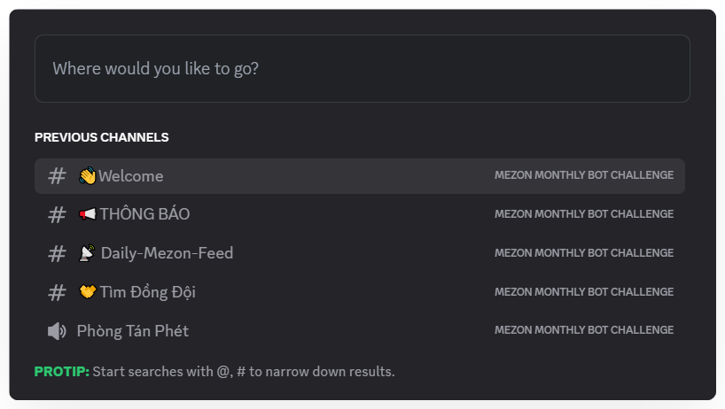
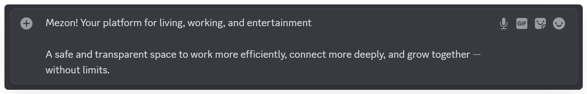
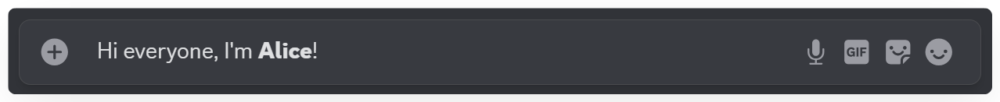
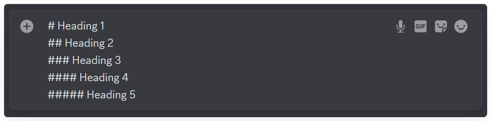
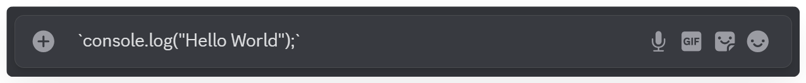
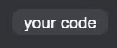
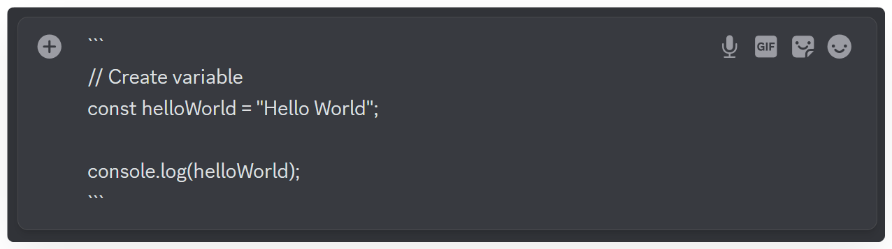
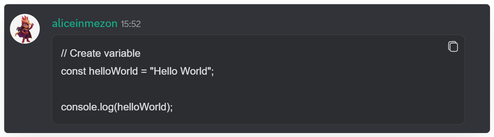

import { Steps, Step } from "@site/src/components/Steps";
import Tabs from "@theme/Tabs";
import TabItem from "@theme/TabItem";
import shortcutsMobile001 from './images/shortcuts-mobile-001.png';
import shortcutsMobile002 from './images/shortcuts-mobile-002.png';
import shortcutsMobile003 from './images/shortcuts-mobile-003.png';
import shortcutsMobile004 from './images/shortcuts-mobile-004.png';
import shortcutsMobile005 from './images/shortcuts-mobile-005.png';
import shortcutsMobile006 from './images/shortcuts-mobile-006.png';
import shortcutsMobile007 from './images/shortcuts-mobile-007.png';
import shortcutsMobile008 from './images/shortcuts-mobile-008.png';
import shortcutsMobile009 from './images/shortcuts-mobile-009.png';

# Shortcuts
Mezon is designed for fast and efficient interactions. Mastering keyboard shortcuts helps you save time, boost productivity, and navigate conversations smoothly.

<Tabs>
<TabItem value="PC" label="PC">
### **Navigation & Search Shortcuts:**

* **Ctrl + K:** **Quick Switcher** - Instantly search and jump between channels, threads, or direct messages. This will likely become your most-used shortcut!



:::tip
* Start your search with @ to find usernames.
* Start your search with # to find Channels or Threads.
:::

### **Communication & Formatting Shortcuts:**

* **Ctrl + G:** **Send Buzz Message** – Sends a Buzz sound to all users in the channel or direct chat, even those with notifications muted, instantly capturing their attention.


* **Shift + Enter:** Create a new line in your message without sending it.



* **Ctrl + Shift + Enter:** **Anonymous Message** - Use this shortcut to enable or disable anonymous messaging mode within a channel.


* **Ctrl + B** or **\*\***&#x79;our tex&#x74;**\*\*:** **Bold** – Quickly format your text while chatting.



* **Big Text – Highlight important messages -** Type **#** followed by a space to create large text in chat.

:::info
Use **# to #####** for heading levels **1–6.**
:::



* **\`your text\`: Code Blocks** - Use single backticks (\`) to highlight text inline.





:::tip
Use triple backticks (**\`\`\`**) to create multi-line code blocks for longer snippets.



:::

### **Interface Management Shortcuts:**

* **Ctrl + Shift + +:** **Zoom In** – Enlarge the app interface for better visibility.
* **Ctrl + -:** **Zoom Out** – Reduce the interface size.
* **Ctrl + 0:** **Reset Zoom** – Restore the display to its default scale.
* **Ctrl + W:** **Hide/Close Window** – On Windows/Linux: closes the tab; on macOS: hides the app.
* **Ctrl + R:** **Reload App** – Restart Mezon to fix minor issues or apply updates.
* **Ctrl + Shift + I:** **Open Developer Tools (DevTools)** – For advanced users or anyone who wants to inspect technical elements of the app.
</TabItem>
<TabItem value="mobile" label="Mobile">
### Anonymous Mode

Allows you to send messages without displaying your username, useful for sharing opinions or feedback objectively.

#### **How to enable:**

1. Open the channel or thread you want to message in.
2. Tap the three-dot icon at the top-left corner.


3. Select **Turn on Anonymous**.


:::info
A hat icon will appear in the message input box, indicating you are in anonymous mode.&#x20;


:::

### **How to disable:**

Tap the three-dot icon again and select **Turn Off Anonymous** to return to normal mode.


### Buzz Mode

Buzz lets you send messages with sound effects to grab everyone’s attention in the channel.

#### **How to send a Buzz:**

1. Type your message in the channel or thread.
2. Enable Buzz via the three-dot icon and send the message.


3. All members in the channel will receive an audible Buzz notification.


:::success
Anonymous is great for sensitive discussions, while Buzz is perfect for highlighting important announcements or prompting quick responses.
:::

***

### Message Formatting

#### **Large Text**

Highlight important messages — type `#` followed by a space to create large text in the chat.\
Use **#** to **######** for heading levels 1 to 6.


#### **Code Block**

* Inline code: `` `your text` `` — highlights a short snippet in a line.


* Multi-line code block: ` ``` ` — use triple backticks for longer code segments.


</TabItem>
</Tabs>