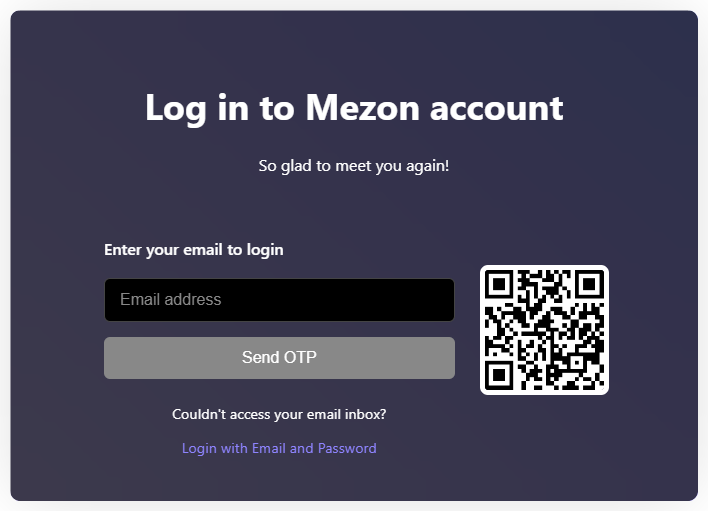
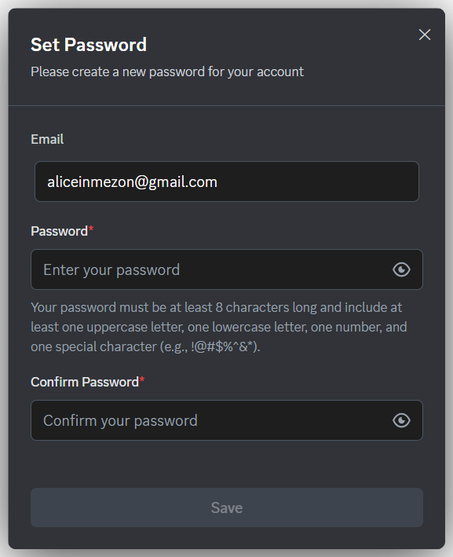
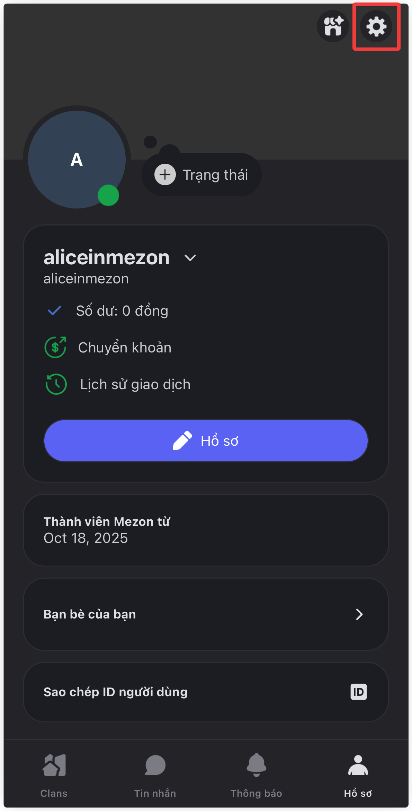
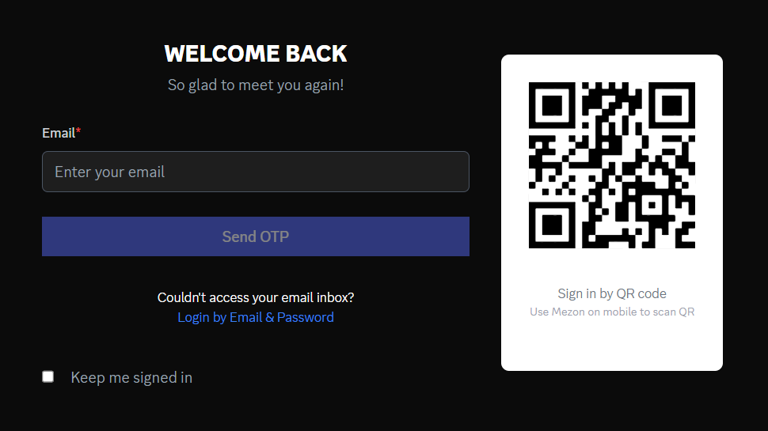
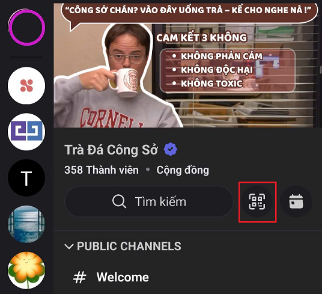

# Sign Up & Log In
Signing up for Mezon is incredibly quick - it takes less than a minute to create your account and start chatting right away.

### **Sign Up with Email and OTP**

1. Enter your email → receive an **OTP** sent to your inbox.
2. Enter the **OTP** to verify your account.

### **Sign Up with Email and Password**

After logging in for the first time, users can set a password in their profile settings.\
Once the password is created, it can be used for future logins to **Mezon**.

:::danger Note
Each user can be logged in on up to **5 devices** simultaneously.
:::

### **Log In with QR (Desktop)**

1. Open **Mezon** on your mobile device.
2. Go to **Profile → Settings → Scan QR**.

3. **Scan the QR code** displayed on your computer screen.

:::tip
**Quick Tip:** You can also tap the **Scan** button at the top of any Clan interface - no need to go through the Settings menu.

:::