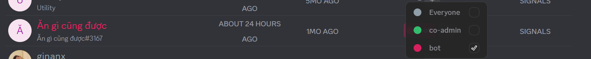

import Tabs from "@theme/Tabs";
import TabItem from "@theme/TabItem";
import manageBotsAndAppsMobile001 from './images/manage-bots-and-apps-mobile-001.png';
import manageBotsAndAppsMobile002 from './images/manage-bots-and-apps-mobile-002.png';

# Manage Bots & Apps
Managing Bots and Apps is just as easy as adding them.

### **View & Adjust**

Go to the **Members** section in your Clan. Here, you’ll see a list of all active Bots and Apps.
<Tabs>
<TabItem value="PC" label="PC">

</TabItem>
<TabItem value="mobile" label="Mobile">

</TabItem>
</Tabs>

### **Customize Roles & Permissions**

Just like regular members, you can assign specific roles to a Bot/App. This helps you control exactly what actions they can perform within your Clan. Adjust permissions under **Clan Settings > Roles**.
<Tabs>
<TabItem value="PC" label="PC">

</TabItem>
<TabItem value="mobile" label="Mobile">

</TabItem>
</Tabs>

### **Advanced Management**

Click on a Bot/App to view its **Profile**. From here, you can:

* Send direct messages to the Bot/App
* Transfer ownership (for Bots/Apps you developed)
* Remove the Bot/App from the Clan if it’s no longer needed
<Tabs>
<TabItem value="PC" label="PC">

</TabItem>
<TabItem value="mobile" label="Mobile">

</TabItem>
</Tabs>

:::tip
Bots are managed just like regular Clan members. You can review and adjust their permissions and roles the same way — through [**Role and Permission Management**.](../clan/create-your-own-clan/manage-clan/overview-settings/roles-and-permissions-management.md)
:::