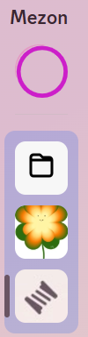

import Tabs from "@theme/Tabs";
import TabItem from "@theme/TabItem";
import clanFolderMobile001 from './images/clan-folder-mobile-001.png';
import clanFolderMobile002 from './images/clan-folder-mobile-002.png';
import clanFolderMobile003 from './images/clan-folder-mobile-003.png';
import clanFolderMobile004 from './images/clan-folder-mobile-004.png';

# Clan Folder
When you join multiple Clans, the left-hand list can become long and hard to manage. Clan Folder helps you group related Clans together, keeping your interface tidy and easy to navigate.

<Tabs>
<TabItem value="PC" label="PC">
### **Creating a Folder:**

1. On the main Mezon interface, select the Clan you want to put into a folder.

2. Drag that Clan onto another Clan. When you see a green dashed rectangle, release the mouse.

3. The folder containing your Clans will appear.

### **Removing a Clan from a Folder:**

1. Open the folder containing your Clans.

2. Hover over the Clan you want to remove and click the **X** icon.

3. After removal, the Clan will appear outside the folder.

</TabItem>
<TabItem value="mobile" label="Mobile">
### How to Create a Clan Folder

1. On the main Mezon interface, **click and hold** the Clan you want to add to a folder.
2. **Drag the Clan onto another Clan**. When you see a square frame showing the two Clans selected, release to group them.

4. A **new Clan folder** will appear in the left-hand menu along with your other Clans.

### How to Remove a Clan from a Folder

1. Open the folder containing your Clans.
2. Click the **X icon** on the Clan you want to remove.

3. After removal, the Clan will appear again outside the folder in your Clan list.

</TabItem>
</Tabs>
