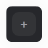
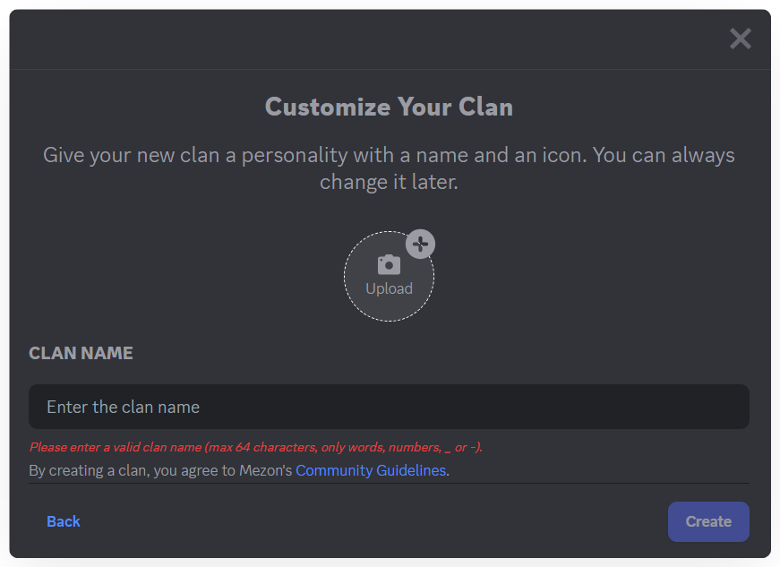

import Tabs from "@theme/Tabs";
import TabItem from "@theme/TabItem";
import createAClanMobile002 from './images/create-a-clan-mobile-002.png';

# Create a Clan
<Tabs>
<TabItem value="PC" label="PC">
1. Click the **“+”** icon on the sidebar → select **Create Clan**.

2. Enter your **Clan name** (up to 64 characters, using only letters, numbers, \_, or -).
3. **Upload an avatar or logo** for your Clan.

:::tip
Don’t worry if the name or image isn’t perfect yet — you can always update the avatar later.
:::

4. Finally, click “**Create**” to set up your Clan.
</TabItem>
<TabItem value="mobile" label="Mobile">
### **Steps to Create a Clan:**

1. Click the **“+” icon**  on the left sidebar.
2. **Enter your Clan name** (up to 64 characters; letters, numbers, `_` or `-` only).

3. **Upload a Clan avatar.**

:::tip
Don’t worry if it’s not perfect — you can update it anytime later.
:::

4. Click **“Create Clan”** to finish setup.
</TabItem>
</Tabs>

