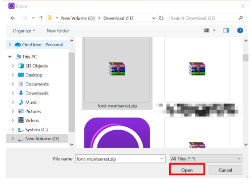
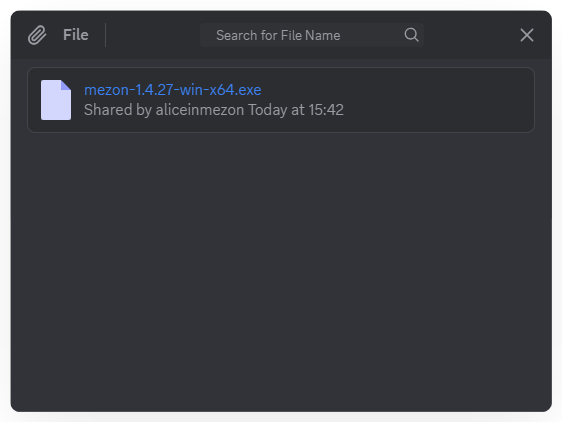
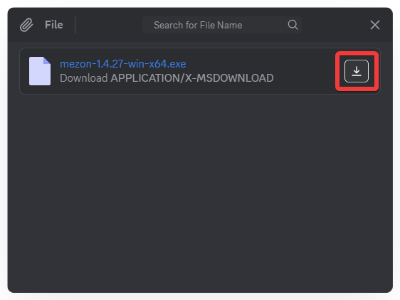

import Tabs from "@theme/Tabs";
import TabItem from "@theme/TabItem";
import filesMobile001 from './images/files-mobile-001.png';
import filesMobile002 from './images/files-mobile-002.png';
import filesMobile003 from './images/files-mobile-003.png';
import filesMobile004 from './images/files-mobile-004.png';
import filesMobile005 from './images/files-mobile-005.png';
import filesMobile006 from './images/files-mobile-006.png';

# Files
Sharing documents is just as important as sharing images. Files allow you to send and quickly access all documents shared in a Text Channel or Thread.

### **How to Send a File:**
<Tabs>
<TabItem value="PC" label="PC">
1. Open the **Text Channel** or **Thread** where you want to share.
2. Click the **plus (+) icon** to the left of the message input box.

3. Select the file and click **Open**.

4. Add a description if needed, or press **Enter** to send immediately.

</TabItem>
<TabItem value="mobile" label="Mobile">
1. Open the Text Channel or Thread you want to share in.
2. Tap the plus (+) icon on the left of the message input box.

3. Select **File**  from the menu.

4. Choose the file you want to send. Add a description if needed and tap **Send**.

</TabItem>
</Tabs>

### **How to View Sent Files:**
<Tabs>
<TabItem value="PC" label="PC">
1. In the **Text Channel** or **Thread**, click the **paperclip icon**  at the top of the channel.
2. The file list will display the **sender** and **time sent**.

3. Click **Download** to save the file to your computer.

</TabItem>
<TabItem value="mobile" label="Mobile">
1. In the Text Channel or Thread, select **Media** from the menu.

2. The file list will show the sender and the time sent.

3. Tap a file to **Download** and view it on your device.
</TabItem>
</Tabs>
