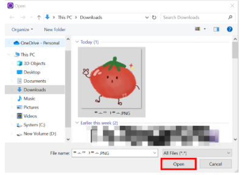
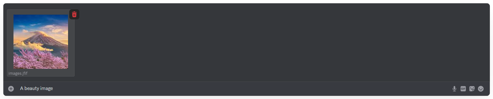
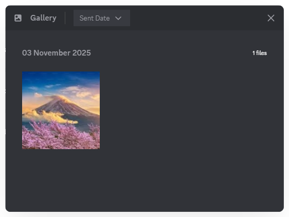
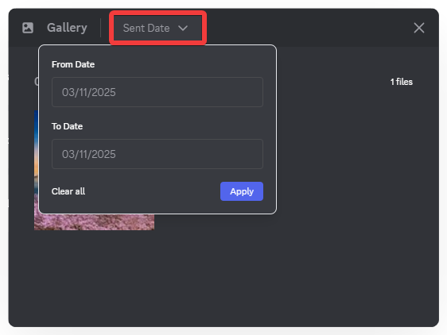
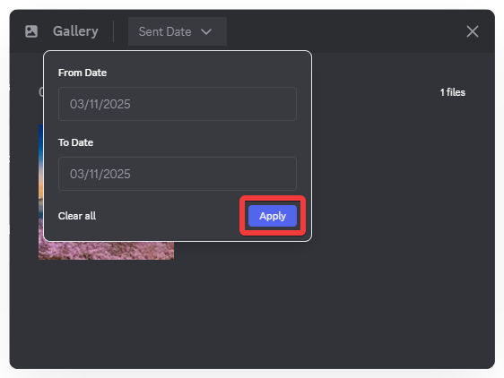

# Gallery
Gallery lets you view all images shared in a Text Channel or Thread and easily filter them by date to find the content you need.

### **How to Send an Image:**

1. Open the **Text Channel** or **Thread** where you want to share.
2. Click the **plus (+) icon** to the left of the message input box.

3. Select the image file and click **Open**.

4. Add a description if needed, or press **Enter** to send immediately.

### **How to View Images:**

1. In the **Text Channel** or **Thread**, click the **photo icon**  at the top of the channel, then select the image you want to view.

2. You can **download**, **rotate**, and **zoom in/out** while viewing an image in detail.

3. Select **Date Sent** to filter images by the sending date.

4. Click **Apply**, and images from the selected time period will be displayed.

