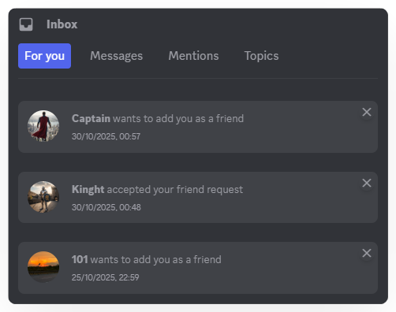
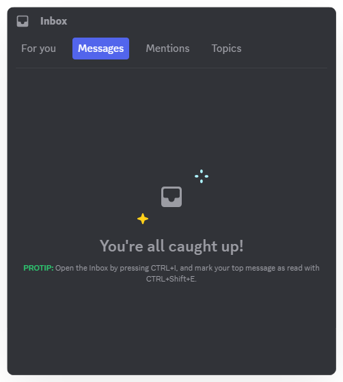
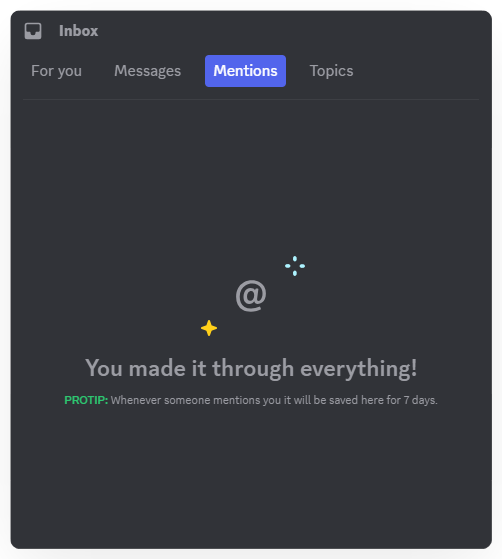
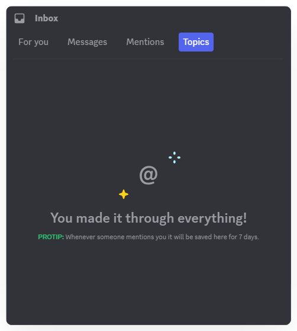
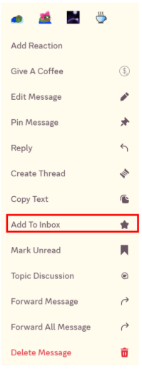

import Tabs from "@theme/Tabs";
import TabItem from "@theme/TabItem";
import inboxMobile001 from './images/inbox-mobile-001.png';
import inboxMobile002 from './images/inbox-mobile-002.png';
import inboxMobile003 from './images/inbox-mobile-003.png';
import inboxMobile004 from './images/inbox-mobile-004.png';
import inboxMobile005 from './images/inbox-mobile-005.png';
import inboxMobile006 from './images/inbox-mobile-006.png';
import inboxMobile007 from './images/inbox-mobile-007.png';

# Inbox
Inbox helps you keep track of important messages and consolidates all key notifications in one place.

### **How to View Inbox:**
<Tabs>
<TabItem value="PC" label="PC">
1. On the channel toolbar, click the **Inbox icon** .
2. Go to **Messages** to see messages you’ve added or important messages from the Clan.

3. Go to **For You** to view notifications such as friend requests or Mezon Coins sent to you.

4. Go to **Mentions** to quickly see messages where you were tagged

5. Go to **Topic** to access all **Topics** (short discussions) in the Clan.

</TabItem>
<TabItem value="mobile" label="Mobile">
1. Go to the bottom navigation bar and tap the 🔔 **Inbox** icon.

2. Here, you can view all activities related to you in the Clan:

* **@ Mentions:** Shows messages where you were directly tagged.

* **Messages:** View messages you’ve marked or important messages from the Clan.

* **Topics:** Access all Topics (short discussions) across different Clans.

* **For You:** Includes notifications like friend requests and received Mezon Dong.

</TabItem>
</Tabs>

### **How to Add a Message to Inbox:**
<Tabs>
<TabItem value="PC" label="PC">
1. Right-click any message.
2. Select **Add to Inbox**.

3. The message will appear under **Inbox → Messages**, making it easy to review later.
</TabItem>
<TabItem value="mobile" label="Mobile">
1. Press and hold the message you want to save.
2. Select **Mark Message**.

3. The message will be added to **Messages** in Inbox, making it easy to revisit anytime.

</TabItem>
</Tabs>
