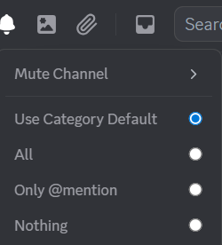

import Tabs from "@theme/Tabs";
import TabItem from "@theme/TabItem";
import Image from "@site/src/components/Image";
import notificationSettings001 from './images/notification-settings-001.png';
import notificationSettings002 from './images/notification-settings-002.png';
import notificationSettingsMobile001 from './images/notification-settings-mobile-001.png';

# Notification Settings
Manage channel notifications to stay informed without being disturbed by irrelevant alerts.

### **How to Customize Notifications:**
<Tabs>
<TabItem value="PC" label="PC">
- Open Mezon and select the **notification icon**  at the top of the channel to customize the notifications.
<Image style={{ margin: '1rem 2rem' }}  src={notificationSettings002} alt="Notification Settings 002" />
</TabItem>
<TabItem value="mobile" label="Mobile">

</TabItem>
</Tabs>

* **Mute Channel** – Completely mute notifications from the channel for a chosen period (e.g., 15 minutes, 1 hour) or until you decide to unmute.
* **Use Category Default** – Apply the same notification settings as the channel’s category.
* **All** – Receive notifications for all messages.
* **Only** **@mention** – Receive notifications only when someone mentions you.
* **Nothing** – Turn off notifications completely.

:::tip
**Tip:** If you are in multiple channels, keep most of them on **Only @mention**. This way, you won’t miss important messages while avoiding constant notification sounds.
:::