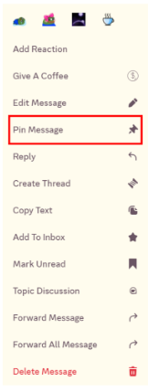
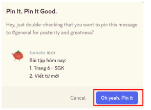
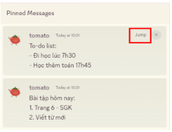

# Pinned Messages
In busy chat channels, Pinned Messages help keep important content easily accessible so everyone can find and review it anytime.

### **How to Pin a Message:**

1. In a **Text Channel**, right-click the message you want to pin.

2. Select **Pin Message**, confirm, and click **Pin**.

3. A notification about the pinned message will appear in the chat. You can click **All Messages** or the **pin icon**  at the top of the channel to review pinned messages.

4. If there are multiple pinned messages, select **Jump** in the pinned list to quickly navigate to the original message.

