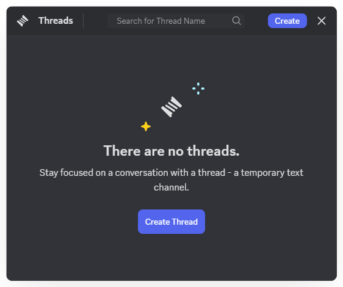

# Threads
Mezon helps you avoid “information chaos” with Threads - separate conversations by topic and Direct Messages, which allow private messaging with individual members.

### **How to Use Threads:**

1. Open Mezon and select the **Text Channel** where you want to communicate.
2. Click the **thread icon**  in the chat toolbar.
3. Select **Create** to start a new thread.
4. Enter the **thread name** and send the first message to begin the discussion with the group.

* To make a thread **private** (visible only to invited members and managers), select **Private Thread** at the bottom.

