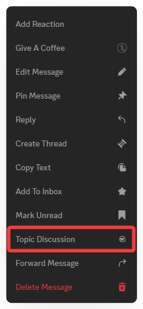
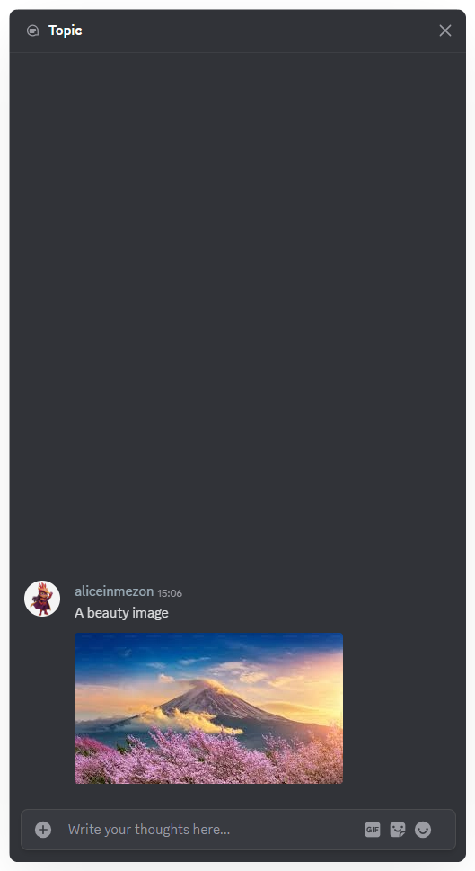

# Topic
Topic in chat allow you to create a separate discussion directly from a message, keeping the main conversation thread clear and organized.

### **How to Add a Topic in Chat:**

1. In a **Text Channel** or **Thread**, right-click the message you want to discuss.
2. Select **Topic Discussion**

3. Enter your message in the **Topic window** on the right to start the discussion.

With **Topic**, you can maintain a focused main conversation while allowing detailed discussions without confusion.