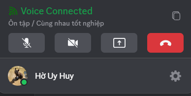

import Tabs from "@theme/Tabs";
import TabItem from "@theme/TabItem";
import Heading from '@theme/Heading';
import voiceChannelMobile001 from './images/voice-channel-mobile-001.png';
import voiceChannelMobile002 from './images/voice-channel-mobile-002.png';

# Voice Channel
Voice Channels are where you can chat, make video calls, or share your screen with your Clan — not just group calls, but a smooth, free space for meetings, online classes, and entertainment.

When joining a **Voice Channel**, you’ll see a range of features that make communication and collaboration comfortable and professional.

<Tabs>
<TabItem value="PC" label="PC">

**Voice Channel Controls:**

1. **Channel Name** – Displays the voice channel you are currently in.
2. **Inbox** – Quickly view messages, mentions, or notifications while in a call.
3. **Participant Sorting** – Options to sort participants for easier viewing.
4. **Voice Chat** – Send text messages directly in the voice channel while talking.
5. **Member Name & Mic Status** – See who is speaking and who is muted.
6. **Connection Quality** – Icon showing network signal strength.
7. **Send Emoji** – React with emojis without interrupting the conversation.
8. **Send Voice Emoji** – Send fun sound effects (voice emojis) during chat.
9. **Mic On/Off** – Toggle your microphone.
10. **Camera On/Off** – Turn your webcam on or off for video chat.
11. **Screen Share** – Share your screen with options:
    * **Application Window** – Share only a selected app, keeping other content private.
    * **Entire Screen** – Share everything visible on your screen.
    * **Share Audio** – Choose to share system audio or only the visual content.
12. **Leave Voice Channel** – Exit the voice channel.
13. **Minimized View** – Detach the voice call window to multitask while staying in the call.
14. **Full Screen** – Expand to full screen to focus on meetings or shared content.

You can also access important controls quickly from your **profile toolbar**, even when viewing another channel.

Use the **Copy** button to quickly share the Voice Channel link in a Text Channel, inviting Clan members to join instantly.

:::warning Note
Each Voice Channel supports up to **500 participants** simultaneously.
:::

With Voice Channel, a Clan can become an **online classroom, a company meeting room, or a fun space to watch movies and listen to music with friends**.
</TabItem>
<TabItem value="mobile" label="Mobile">

<Heading as="h3">Key Features in Voice Channels</Heading>

1. **Minimize Button:** Continue the call while navigating other parts of the app.
2. **Channel Name:** Displays the Voice Channel you are in.
3. **Send Emojis:** React with emojis during the call without interrupting.
4. **Send Sound Effects:** Add fun audio effects while talking.
5. **Speaker Mode:** Switch between internal and external speakers.
6. **Participant Area:** Shows names, avatars, or shared screens of attendees.
7. **Toggle Camera:** Turn your video on or off.
8. **Chat While Calling:** Open a chat window during the call; messages are saved.
9. **End Call:** Disconnect and leave the channel.

:::warning
Each Voice Channel can host up to **500 participants** simultaneously.
:::

> #### Not Available
>
> #### Screen Sharing Options
>
> * **Application Window:** Share only a specific app window without revealing other information.
> * **Entire Screen:** Share your full display so others see exactly what you see.
> * **Share Audio:** Choose whether to include system audio along with the screen.
>
> 

>
> #### Quick Actions
>
> You can access important functions directly from your profile bar, even while viewing other channels.
>
> * **Copy Button:** Quickly send the Voice Channel link to a Text Channel and invite Clan members to join.
>
> Voice Channels transform a Clan into an online classroom, company meeting room, or a hangout space for watching movies and listening to music with friends.

</TabItem>
</Tabs>
