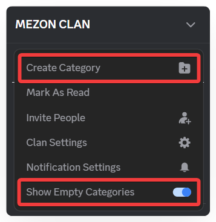
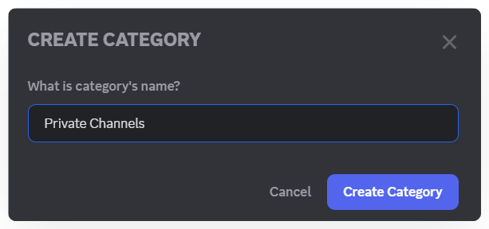
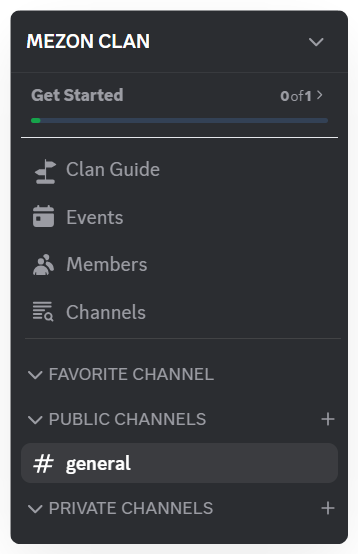

import Tabs from "@theme/Tabs";
import TabItem from "@theme/TabItem";
import clanCategoryMobile001 from './images/clan-category-mobile-001.png';
import clanCategoryMobile002 from './images/clan-category-mobile-002.png';
import clanCategoryMobile003 from './images/clan-category-mobile-003.png';
import clanCategoryMobile004 from './images/clan-category-mobile-004.png';

# Clan Category

As your Clan grows, the number of channels can increase quickly, making it difficult to keep track. Categories help group related channels, keeping everything organized and easier to navigate for all

### **How to Create a Category:**
<Tabs>
<TabItem value="PC" label="PC">
1. Click your **Clan name**, then select **Create Category**. Make sure **Show Empty Category** is enabled.

2. Enter the **Category name** you want and click **Create Category**.

3. The new Category will appear on the left-hand navigation panel.

4. You can move channels between Categories by **dragging and dropping** them into the desired position.

:::tip
You can also **customize notifications** for a Category, similar to customizing notifications for the Clan or individual channels.
:::

Categories reduce information clutter, save time searching for content, and ensure everyone can easily find the topics they care about. With Categories, the workspace and community on Mezon remain **clear, organized, and easy to manage**, whether your organization has dozens or hundreds of channels.

</TabItem>
<TabItem value="mobile" label="Mobile">
1. Click your Clan name, then select **Create Category**. Make sure **Show Empty Categories** is enabled.

2. Enter the category name and press **Create**.

3. The new category will appear in the **Clan Navigation** panel.

> Categories reduce information clutter, save search time, and ensure everyone can easily follow relevant content. With categories, your workspace and community on Mezon remain organized and easy to manage — even if your organization has dozens or hundreds of channels.

### How to Manage a Category

Press and hold the category you want to manage.&#x20;

You can then:

- **Mark as Read:** Clear all unread notifications from channels in this category.
- **Mute Notifications:** Stop receiving alerts from channels under this category.
- **Notification Settings:** Customize how you receive notifications.
- **Edit Category:** Change the category name.
- **Create Channel:** Add a text, voice, or live channel within the category.
- **Delete Category:** Remove the category along with all its channels.
- **Copy Clan ID:** Copy the identifier for technical or administrative purposes.

:::tip
Categories help you manage your Clan structure quickly and visually, even on mobile.
:::

</TabItem>
</Tabs>
