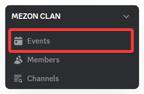
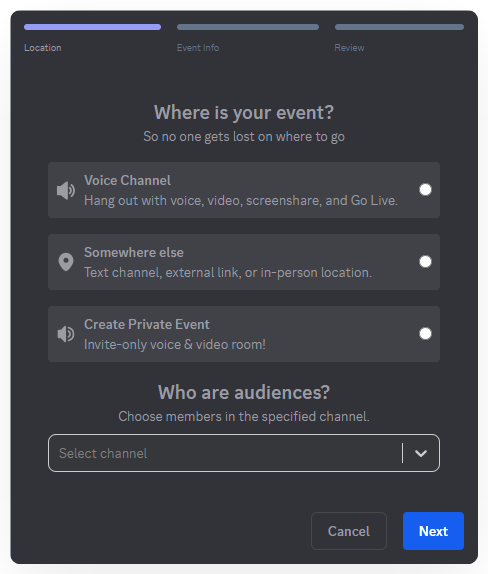
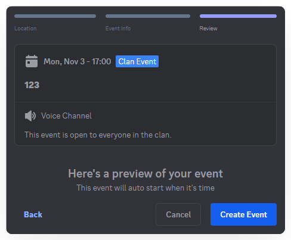

import Tabs from "@theme/Tabs";
import TabItem from "@theme/TabItem";
import creatingAndManagingEventsMobile001 from './images/creating-and-managing-events-mobile-001.png';
import creatingAndManagingEventsMobile002 from './images/creating-and-managing-events-mobile-002.png';
import creatingAndManagingEventsMobile003 from './images/creating-and-managing-events-mobile-003.png';
import creatingAndManagingEventsMobile004 from './images/creating-and-managing-events-mobile-004.png';
import creatingAndManagingEventsMobile005 from './images/creating-and-managing-events-mobile-005.png';
import creatingAndManagingEventsMobile006 from './images/creating-and-managing-events-mobile-006.png';

# Creating & Managing Events
Events are the heartbeat of a community — from team meetings and workshops to social gatherings. On Mezon, you can easily create and manage all these activities in just a few steps.

### **Types of Events:**

When creating an Event, you can choose the format that fits your needs:

1. **Clan Event – Community-wide Event**
   * For large-scale activities open to the entire Clan.
   * Hosted directly in a **Voice Channel**, utilizing all voice, video, screen share, and chat features.
2. **Channel Event – Event within a Channel**
   * Ideal for small groups or specialized topics.
   * Each channel can host its own event, keeping discussions or group activities organized without cluttering the general space.
3. **Private Event – Private, Barrier-free Meeting**
   * Create an online meeting room accessible to anyone — even users without a Mezon account.
   * No login required; participants join directly via the link.
   * Completely free, with no time limits.
   * Full features: voice, video, chat, screen sharing.

:::tip
**Private Events** can replace Google Meet, Zoom, or Teams in many situations — faster and more flexible.
:::

<Tabs>
<TabItem value="PC" label="PC">
### **How to Create an Event:**

1. In the left navigation panel, select **Events**.

2. **Choose the Event Location:**

* **Voice Channel** – Host the event in an existing Clan voice channel, using Mezon’s voice, video, and screen sharing features.
* **Somewhere Else** – If the event is offline or on another platform, you can add a link or address for easy access.
* **Private Event** – Create a separate online room with a fixed link, ideal for inviting people outside Mezon.

3. Enter the **Event details** and click **Next**.

  

:::warning
Maximum **Event Cover Image** size: 1 MB.
:::

4. Review the Event content and click **Create**.

5. Your Event will appear under **Events** in the left navigation panel.

</TabItem>
<TabItem value="mobile" label="Mobile">
### How to Create an Event

1. Click your Clan name, then select **Create Event**.

2. **Choose the Event Location**

* **Voice Channel:** Host the event directly in an existing Clan voice channel, leveraging Mezon’s voice, video, and screen sharing features.
* **Audience Settings:**
  * **No channel selected:** The event becomes a **Clan Event**, visible and open to all Clan members.
  * **Channel selected:** The event becomes a **Channel Event**, only visible to members of the chosen channel.
* **Other Locations:** For real-life events or on other platforms, you can add a link or address so participants can easily follow and join.
* **Private Event:** Create an online meeting room that anyone can join — even users without a Mezon account. No login required, just click the link to join. Fully free, no time limits, with full features: voice, video, chat, and screen sharing.

3. Enter event details and click **Next**.

:::warning
Maximum event cover image size: 1 MB
:::

4. Review the event details and click **Create Event**.

5. Your event will appear under the **Events 📅** section in the Clan main menu.

</TabItem>
</Tabs>
