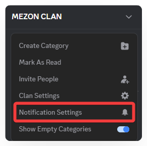
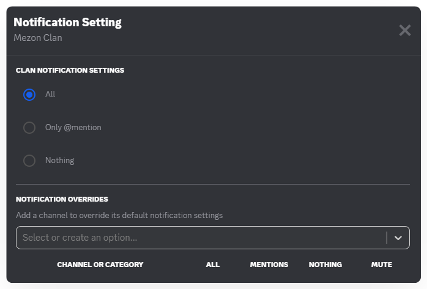

# Managing Notifications in a Clan
When you first join, the flood of notifications can feel overwhelming. Don’t worry — you can easily adjust them to suit your needs.

### **How to Manage Clan Notifications:**

1. Right-click on the **Clan icon**.
2. Select **Notification Settings**.
3. Choose your preferred option:
   * **All** → Receive all messages.
   * **Only @mention** → Only receive notifications when someone mentions you.
   * **Nothing** → Turn off notifications completely.
   * **Use category default** → Follow the default notification settings of the channel group.
4. Alternatively, use **Mute Channel** to temporarily pause notifications for **15 minutes, 1 hour, 3 hours, 8 hours, 24 hours**, or until you turn them back on.

:::warning Note
If you’re in multiple Clans, set most to **Only @mention**. This way, you won’t miss important updates, yet avoid constant “ding” notifications all day.
:::

Additionally, you can manage detailed notification settings for each Channel within a Clan by clicking the Clan name and selecting **Notification Settings**.

:::tip
**Notification Badge:** On the Taskbar, you can quickly check notification status through the Mezon icon:

* **Only Mezon Logo:** No new notifications.
* **Red Dot next to the Mezon Logo:** You have new notifications.
* **Number next to the Mezon Logo:** Someone mentioned you — the number indicates how many mentions you’ve received.
:::