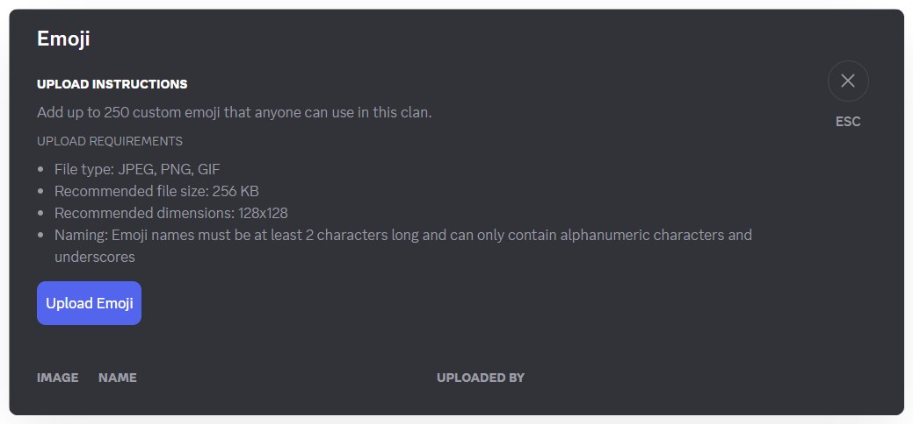
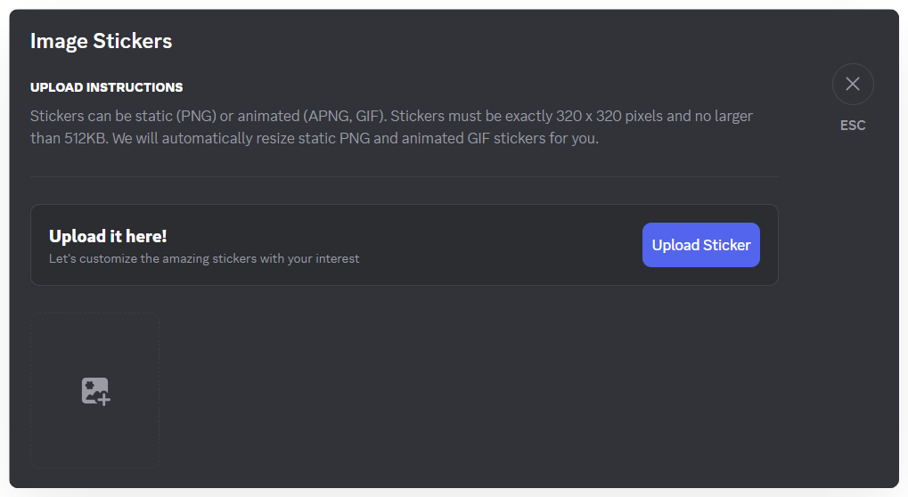

# Emoji, Image & Voice Stickers
In online communication, they help create a fun, close, and community-specific space.

### **How to Add Emojis**

1. In the left menu, select **Emojis**, **Image Stickers**, or **Voice Stickers** depending on your needs.

2. Click **Upload Emoji/Image/Voice Sticker**.

* Maximum: 250 emojis per Clan
* File types: JPEG, PNG, GIF
* Maximum file size: 256 KB
* Recommended size: 128x128 pixels
* Naming: Minimum 2 characters; letters, numbers, and underscores only

* Maximum: 250 image stickers per Clan
* File types: PNG, APNG, GIF
* Maximum file size: 512 KB
* Recommended size: 320x320 pixels
* Naming: Minimum 2 characters; letters, numbers, and underscores only

* Maximum: 250 voice stickers per Clan
* File types: MP3, WAV
* Maximum file size: 1 MB
* Naming: Minimum 2 characters; letters, numbers, and underscores only

3.  Click **Browse** to select the emoji/sticker you want to add, then click **Upload** to complete.

    

You can also check **“This is a paid item”** when uploading an emoji or image sticker to require users to purchase it using Mezon Coins. Currently, the default price is **500 Mezon Coins per emoji/sticker**.

> Each emoji or sticker is a piece of internal culture, helping your community bond and be easily recognized. Members are free to propose and design emojis, making conversations more lively. They also allow for quick, concise, and humorous expression -perfectly aligning with Mezon’s spirit of **“Play together, work together.”**