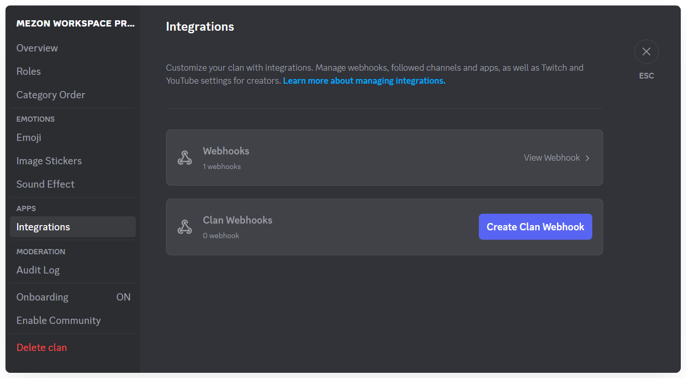

import Tabs from "@theme/Tabs";
import TabItem from "@theme/TabItem";
import integrationsMobile001 from './images/integrations-mobile-001.png';

# Integrations

<Tabs>
<TabItem value="PC" label="PC">

</TabItem>
<TabItem value="mobile" label="Mobile">

</TabItem>
</Tabs>

Mezon provides powerful tools to interact with your Clan through **Webhooks**. Learn how to set up and use webhooks in the **[Webhook Docs](/developer/webhooks)**.