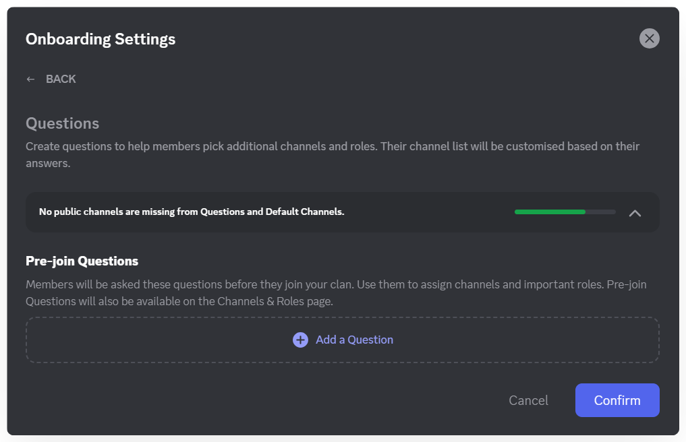
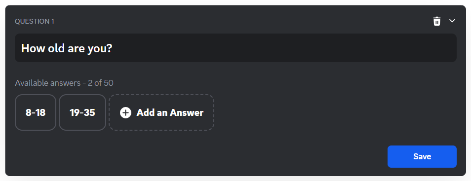
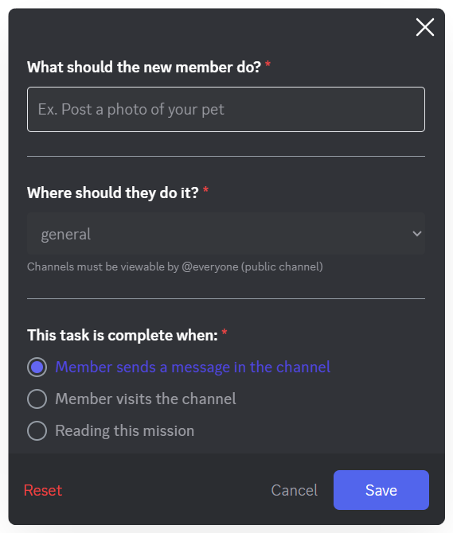
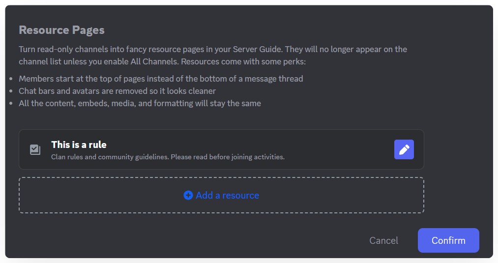
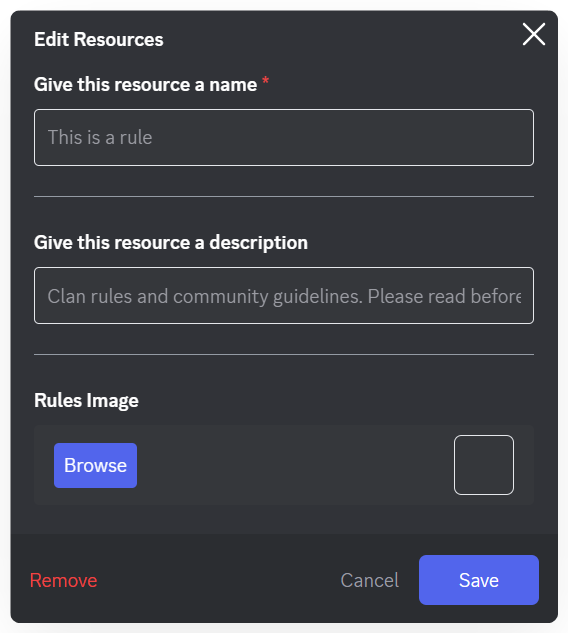

# New Member Guide
Set up a welcoming experience for new members.

### **1. Enable Onboarding**

1. In the options list, select **Onboarding**.
2. You’ll see an introduction screen for Onboarding. Click **Enable Onboarding** to activate the feature.

3. Once enabled, the **Onboarding Settings** window will appear, allowing you to configure the details.

### **2. Configure Onboarding Settings**

After activation, there are two main sections to configure the onboarding experience: **Questions** and **Clan Guide**.\
You’ll see the message **“Onboarding Is Enabled”** in the settings window.

#### **2.1 Set Up Questions**

This section lets you create questions for new members to answer.

* Click **Set Up** next to **Questions**.

* Here you can define questions and optional answers to guide new members, helping them choose channels or roles that fit their interests.

* Click **Add a Question** to start creating questions for new members. These are interactive guides, helping newcomers get familiar with the Clan. There are no right or wrong answers, only useful information.

#### **2.2 Set Up Clan Guide**

This section allows you to build a complete welcome guide for new members, including welcome messages, banners, tasks to complete, and helpful resources.

How to: Click the "**Edit**" button next to the Clan Guide entry.

#### **New Member To-Do’s**

This is a list of 3–5 tasks you want new members to complete to encourage interaction and participation.

:::tip
Avoid overly general tasks like “chat with the community.”
:::

**Step 1: Add a Task** – Click **Add a task**

\
**Step 2: Configure the Task**

* **What should the member do?** – Enter a description (e.g., “Introduce yourself in #introductions”).
* **Where should they do it?** – Select the public channel for the task.
* **When is the task complete?** – Choose one of three conditions: Member sends a message in the channel, Member accesses the channel, or Member reads the task.
* Click **Save** to save the task.

#### **Resource Pages**

Resource Pages let you turn read-only channels into professional resource pages within the Clan Guide, making it easier for new members to access important information.

**Creating and Editing Resource Pages**\
**Step 1: Create a Resource Page**

* In the Clan Guide section, scroll to **Resource Pages**.
* Click **Add a resource**.
* Select an existing read-only channel you want to convert into a resource page and click **Create**.

**Step 2: Edit Resource Page Information**

After adding, click the resource to open **Edit Resources**.

* **Display Name**: Give the page a title (e.g., “Clan Rules”).
* **Description**: Enter the content you want to share with new members.
* **Rules Image**: Upload an illustrative image by clicking **Browse**.
* Click **Save** to save changes.

Once completed, the New Member Guide will appear under the **Guide** page below the Clan name.

:::warning Note
Maximum file size for **Resource Page Rules Image**: 10 MB
:::

### **3. Disable Onboarding**

If you no longer want to use Onboarding:

1. Go to **Clan Settings > Guide**.
2. Click the red **Disable Onboarding** button at the top-right corner of the screen.

